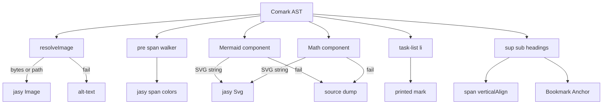

# Close comark-pdf mapper gaps

Work stays in [`packages/comark-pdf`](packages/comark-pdf).

**Rule of ownership**

| Layer | Job |
| --- | --- |
| `comark-pdf` | Read the Comark AST. Choose policy. Call jasy primitives. |
| `jasy` | Draw and lay out PDF primitives. Do not parse Markdown, Mermaid, KaTeX, or Shiki. |

This plan is **not** “all workarounds” and **not** “wait for jasy”. Each item below is classified.

## Ownership

| Item | Ideal owner | This plan | Wait for jasy? |
| --- | --- | --- | --- |
| Highlighted code | `comark-pdf` | Ideal | No |
| Mermaid → SVG | `comark-pdf` | Ideal | No |
| Math → SVG | `comark-pdf` | Ideal | No |
| Task-list mapping | `comark-pdf` | Ideal (mark choice is local) | No |
| Embed policy, data-URI, alt fallback | `comark-pdf` | Ideal | No |
| HTTP image fetch | **jasy** (+ policy in `comark-pdf`) | Workaround (still ship) | No |
| True inline image in a line | **jasy** | Workaround (block split) | Only if you need in-sentence images |
| `sup` / `sub` | `comark-pdf` | Ideal (was missing) | No |
| Heading bookmarks / outline | `comark-pdf` | Ideal (was missing) | No |
| Page-foot footnotes | **jasy** + mapper | Deferred | Yes, for page-foot notes |
| Full HTML layout | Nobody | Deferred | No — do not request it |

Ask Florian for `Image(url)` (parity with `addFontFromUrl`) and a footnote / endnote **page region**. Do not ask for a highlighter, TeX, Mermaid, or `Html()`.



## 1. Image embed (block + inline + HTTP)

**Ideal in `comark-pdf`:** embed policy (`visuals.image === 'embed'`), data-URI decode, alt-text fallback, SSRF opt-in.

**Workaround:** HTTP fetch in [`src/image.ts`](packages/comark-pdf/src/image.ts) copies jasy `addFontFromUrl`. Ship it so we do not wait. Prefer jasy `Image` from URL later; then delete the fetch half and keep policy.

**Workaround:** inline `img` cannot sit in `span()`. Split the paragraph into a `Column` of text + `Image` + text. True in-sentence images need a jasy inline-replaced primitive. The split is enough for figures and most Markdown.

Today [`jasy.ts`](packages/comark-pdf/src/jasy.ts) only embeds when `visuals.image === 'embed'`, and it passes `src` straight to `Image()`. Inline `img` always becomes `[alt]`. Default (no embed) stays alt-text.

Single resolve path:

- Empty `src` → fallback.
- `data:image/...;base64,` → decode to `Uint8Array`.
- `http://` / `https://` → `fetch` with a timeout (~15s) and a byte cap (~8MB).
- Else → local path / bytes to `Image()`.
- Fetch or decode failure → fallback (do not throw).

Only when `visuals.image === 'embed'`. Same helper for block and inline. Keep `width` / `height`.

## 2. Code highlighting (rangi / Shiki)

**Ideal in `comark-pdf`.** jasy already has colored `span()`. Do not ask jasy for a highlighter.

Rangi and Shiki rewrite `pre > code` into token nodes with `style="color:…"`. Our `pre` handler flattens that with `textContent()`.

```418:424:packages/comark-pdf/src/jasy.ts
    case 'pre': {
      const code = textContent(children).trimEnd()
      return Box(
        { bg: '#f6f8fa', padding: 12, radius: 4 },
        [Text(code, { font: 'Courier', size: 10 }) as PDFElement],
      ) as PDFElement
    }
```

Walk `code` / `span` / line wrappers:

- Read `style` color (first `color:`; ignore `--shiki-dark*`).
- Emit `span(text, { font: 'Courier', size: 10, color })`.
- Keep `\n` as line breaks inside one `Text([...spans])`.
- Use `pre` background from `attrs.style` when present; else `#f6f8fa`.
- No highlighter plugin → still monospace.

No new `plugins/highlight.ts`. Hosts already pass `rangi()` / `shiki()`.

## 3. Mermaid → `Svg()`

**Ideal in `comark-pdf`.** jasy already has `Svg()`. Do not add Mermaid to jasy.

Comark stores source on a `mermaid` node. [`plugins/mermaid.ts`](packages/comark-pdf/src/plugins/mermaid.ts) dumps that source.

Make `Mermaid` async:

1. Dynamic-import `mermaid` (or `beautiful-mermaid` if it exposes render-to-SVG).
2. `mermaid.render(id, source)`; pass theme from attrs when present.
3. If `globalThis.document` is missing (Node), try optional `happy-dom`; else fall back to the source box. That is a Mermaid limit, not a jasy gap.
4. `sanitizeSvgLengths` + `Svg()`.
5. On error, keep the monospace source box.

Optional peer only. No hard mermaid dependency.

## 4. Math → `Svg()`

**Ideal in `comark-pdf`.** KaTeX emits HTML. jasy must not grow TeX or MathML. MathJax SVG is a host choice because KaTeX has no SVG output.

In [`plugins/math.ts`](packages/comark-pdf/src/plugins/math.ts):

- Dynamic-import `mathjax-full` (lite adaptor + TeX + SVG).
- Inline: `Svg` at text size (~11pt). Display: `Svg` in the tinted `Box`.
- If the peer is missing or TeX fails, keep Courier source.
- Optional peer only.

Keep the `Math` component export.

## 5. GFM task-list glyphs

**Ideal in `comark-pdf`.** jasy does not need a task-list primitive.

AST: `ul`/`ol.contains-task-list`, `li.task-list-item`, leading `input` with `:checked` / `:disabled` as `'true'` strings. Do not run `:checked` through `resolveBoundAttrs` (it treats `:` as a data path).

Prefer printed marks **`[x]` / `[ ]`** (Courier). Helvetica lacks ☐/☑, and `Checkbox` creates AcroForm fields. Use read-only jasy `Checkbox` only if a baked widget is required.

- Replace the `•` / `1.` marker on task items.
- Drop the `input` node.
- Leave normal lists unchanged.

## 6. `sup` / `sub` and heading outline

**Ideal in `comark-pdf`.** These were missing from the earlier plan. jasy already has the primitives.

- Map `sup` / `sub` to `span(..., { verticalAlign, size })`.
- Emit `Bookmark` / `Anchor` from `h1`–`h6` so the PDF outline matches headings.

## 7. Tests, playground, README

- Embed: mock `fetch` success → valid PDF; fail / timeout / oversize → alt-text, no throw.
- Data-URI embed → valid PDF.
- Inline `` with embed uses the same resolve path.
- `rangi()` fenced block → valid PDF.
- Task list `- [x]` / `- [ ]` → valid PDF.
- `E=mc^2` style `sup` / a heading outline does not throw.
- Mermaid / Math: valid PDF; fallback still produces PDF if SVG deps or DOM are missing.

Playground: add a task list; keep math / mermaid.

README Feature support: move embed images, highlighted code, Mermaid SVG, Math SVG, task-list marks, `sup`/`sub`, and heading bookmarks to **Supported** (name fallbacks). **Not yet:** raw HTML layout, page-foot footnotes. Note that native jasy `Image(url)` and a footnote region are still useful, not blockers.

## Out of scope

- **Full HTML as layout** — nobody. jasy will not be a CSS engine. Do not request `Html()`. A tiny HTML subset would be a later `comark-pdf` job, not this plan.
- **Page-foot footnotes** — needs a jasy page region (header/footer chrome is the wrong tool). Mapper can parse refs later. Endnotes at document end are possible in `comark-pdf` without jasy; not in this pass.
- Waiting to **ship** until jasy has `Image(url)` — we ship the fetch workaround.
- New files beyond [`src/image.ts`](packages/comark-pdf/src/image.ts).
