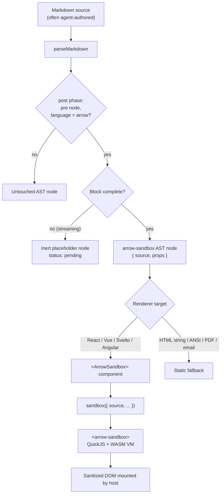
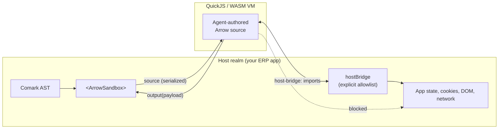

# `comark-arrow` — Requirements

> Execute agent-authored ArrowJS source embedded in Comark documents, sandboxed, with no upfront component registration.

---

## 1. Naming

| | |
|---|---|
| Package | `comark-arrow` |
| Fence keyword | `arrow` |
| Component | `<ArrowSandbox>` |

Third-party tier (unscoped `comark-*`), consistent with the sibling packages `comark-vega`, `comark-flint` and `comark-etiket`, which each shorten the upstream library name.

The fence keyword matches the convention of `mermaid`, `math` and `json-render` — the fence names the language, not the package.

---

## 2. Problem statement

Comark's component model requires the application developer to pre-register components ahead of time; authored markdown can only *reference* them:

```markdown
::chart{:data="metrics"}
```

An AI agent generating Comark markdown has no control over component registration. It can compose widgets a developer already built, but it cannot author a genuinely new one. The existing plugins do not close this gap:

- `json-render` maps a declarative spec onto **pre-registered** components — the agent supplies data, not logic.
- `shiki` / `rangi` render a fenced block as **inert highlighted text**.
- `mermaid` executes a fenced block, but only for a **fixed diagram DSL**, not arbitrary UI logic.

React, Vue, Svelte and Angular cannot close this gap even in principle: JSX and SFCs require a compile step, so agent-authored source has nowhere safe to run without an in-browser compiler or `eval` in the host realm.

ArrowJS closes it. It has no build step (plain tagged template literals), and `@arrow-js/sandbox` executes untrusted source inside a QuickJS/WASM VM where the host page only mounts sanitized DOM and communicates by serialized message. The upstream docs position it explicitly for "inline UI produced by chat agents."

**Goal:** a plugin that turns an ` ```arrow ` fenced block in a Comark document into a live, sandboxed, interactive widget — with zero upfront registration of that widget.

---

## 3. Scope

### In scope

- Parse-phase plugin that claims ` ```arrow ` fenced code blocks and emits a dedicated AST node.
- An `<ArrowSandbox>` renderer component, shipped per-framework, that boots `@arrow-js/sandbox` for that node.
- A `hostBridge` contract for exposing allowlisted host data/functions to sandboxed code.
- Streaming safety: never execute an incomplete block mid-stream.
- Graceful degradation for renderers that cannot execute (HTML string, ANSI, PDF, email).

### Out of scope

- A `comark-arrow` **document renderer** (an Arrow-native equivalent of `@comark/react` / `@comark/vue`). Arrow's `sandbox()` mounts via a plain `<arrow-sandbox>` custom element, so it drops into any existing renderer's tree. Adopting Arrow as the app's rendering framework is a separate, unrelated decision.
- Server-side execution of sandboxed widgets.
- Persisting widget state across renders or sessions.

---

## 4. Reference implementations

Two existing built-ins bracket the design; the plugin borrows from both.

| Aspect | Reference | What to copy |
|---|---|---|
| Parse-phase fence → AST node transform | `json-render` | Runs in the `post` phase, walks the AST for `pre` nodes matching a `language`, replaces the node. |
| Ships its own renderer component | `mermaid` | Plugin marks the fence; a component exported alongside the plugin (`import mermaid, { Mermaid } from '...'`) does the actual client-side rendering and must be passed to `components`. Also the precedent for fence-attribute props (`` ```mermaid {theme="dark"} ``). |

`mermaid` is the closer behavioural analogue — like Arrow, it defers to a client-side runtime — while `json-render` is the closer structural analogue for the AST rewrite itself.

---

## 5. Architecture



### Trust boundary



The sandbox guarantees the widget cannot reach the host realm except through `hostBridge` and `output()`. It does **not** guarantee the widget's logic is correct — see §9.

---

## 6. Syntax

### 6.1 Fenced (primary)

The source *is* the payload, so the fence maps almost 1:1 onto `sandbox({ source: { 'main.ts': … } })`.

~~~markdown
```arrow
import { html, reactive } from '@arrow-js/core'

const state = reactive({ qty: 1, unit: 24.5 })

export default html`
  <div>
    <input .value="${() => state.qty}" @input="${(e) => state.qty = +e.target.value}" />
    <strong>Total: ${() => (state.qty * state.unit).toFixed(2)}</strong>
  </div>
`
```
~~~

Fence attributes follow the `mermaid` precedent:

~~~markdown
```arrow {height="320px" shadow-dom="false"}
…
```
~~~

### 6.2 Multi-file

Arrow's `sandbox()` accepts `main.ts`/`main.js` plus optional `main.css`. A single fence carries only `main.ts`. For styles, support an adjacent labelled fence or a `css` sub-fence convention — **open question, see §11**.

### 6.3 Component syntax (bound source)

Per the pattern established for `comark-vega`/`comark-flint`, a `::`-form allows the source to come from bound data rather than from the document:

```markdown
::arrow{:source="widgets.reorderCalculator"}
```

Note the `:` prefix — only `:`-prefixed props participate in `@comark/binding`; a plain `source="…"` would be a literal string.

Both forms MUST produce the same AST node shape and render through the same `<ArrowSandbox>` component.

---

## 7. AST node contract

```ts
interface ArrowSandboxNode {
  type: 'arrow-sandbox'
  source: string              // main.ts contents
  css?: string                // main.css contents, if supplied
  status: 'ready' | 'pending' // 'pending' while streaming (see §8)
  props: {
    height?: string
    shadowDom?: boolean
    debug?: boolean
  }
}
```

The node must be JSON-serializable, so it survives Comark's parse-on-server / render-on-client split and `renderMarkdown()` round-tripping back to source form.

---

## 8. Streaming requirements

This is the highest-risk area and the one least covered by the reference plugins.

Comark's core promise is handling token-by-token AI output, auto-closing unterminated syntax so the document renders at every frame. Applied naively here, that means a **half-written Arrow program would be handed to the VM and executed** — repeatedly, on every frame, as the agent types.

Requirements:

- **R8.1** The plugin MUST NOT emit an executable node for a block whose closing fence has not been seen. Emit `status: 'pending'` instead.
- **R8.2** `<ArrowSandbox>` MUST render a non-executing placeholder for `status: 'pending'` (skeleton, spinner, or dimmed source preview).
- **R8.3** The VM MUST be booted at most once per completed block, not per streaming frame. Re-boot only when the `source` string actually changes after completion.
- **R8.4** A syntax error in a completed block MUST surface through `onError` as an inline error state, never as an unhandled throw that breaks the surrounding document render.

---

## 9. Security requirements

- **R9.1** All agent-authored source executes inside the QuickJS/WASM VM. The plugin MUST NOT provide any path that evaluates the source in the host realm.
- **R9.2** The sandboxed code has no ambient access to host state, DOM, cookies, or network. Any data it needs MUST be supplied explicitly through `hostBridge`.
- **R9.3** `hostBridge` modules MUST be an explicit allowlist supplied by the application, never derived from anything in the document. An agent must not be able to widen its own data access by what it writes.
- **R9.4** `hostBridge` functions SHOULD be read-only by default. Any mutating bridge function (write to an ERP record, trigger an action) MUST be an explicit, separately-reviewed opt-in, ideally routed through a confirmation step rather than callable directly by generated code.
- **R9.5** Interaction with `comark/plugins/security` must be defined: that plugin sanitizes the AST and blocks unsafe protocols. Its relationship to `arrow-sandbox` nodes needs an explicit decision — most likely an opt-in allowlist, so that enabling `security()` does not silently strip sandbox nodes, nor silently permit them without the integrator knowing.
- **R9.6** Documentation MUST state plainly that isolation is not correctness. The sandbox prevents a generated widget from escaping; it does not prevent it from computing or displaying something wrong. In an ERP context — where a widget may show a stock level, a price, or a total someone acts on — generated widgets need the same review posture as generated numbers.

### Example: bridging ERP data

```ts
<ArrowSandbox
  hostBridge={{
    'host-bridge:erp': {
      getStockLevel: (sku: string) => inventory.read(sku),   // read-only
      getFxRate: (pair: string) => fx.read(pair),            // read-only
    },
  }}
/>
```

```ts
// inside the sandboxed block
import { getStockLevel } from 'host-bridge:erp'
```

---

## 10. Renderer support matrix

| Target | Behaviour |
|---|---|
| React | Full — `<ArrowSandbox>` from `comark-arrow/react` |
| Vue | Full |
| Svelte | Full |
| Angular | Full |
| Nuxt | Full (client-side only; must not execute during SSR) |
| HTML (string) | Static fallback — highlighted source or placeholder |
| ANSI | Static fallback — source or a one-line notice |
| `comark-pdf` / `comark-email` | Static fallback, mandatory |

- **R10.1** Every non-executing target MUST degrade to a defined static representation. A blank gap where a widget should be is not acceptable, particularly for PDF and email, which carry a large share of ERP output.
- **R10.2** The fallback SHOULD be configurable (render the source, render a placeholder, or render a caption such as "interactive widget — view online").
- **R10.3** SSR MUST NOT boot the VM. The sandbox is a browser-only runtime; server render emits the placeholder and the client takes over on mount.

---

## 11. Open questions

1. **Multi-file syntax.** How does a block supply `main.css` alongside `main.ts`? Options: a paired ` ```arrow-css ` fence, a `---`-delimited section inside one fence, or a frontmatter-style header. Leaning toward a paired fence for streaming friendliness.
2. **`security()` interaction (R9.5).** Allowlist, strip, or ignore by default? Defaulting to *strip* is the safer posture but risks silent breakage; defaulting to *allow* risks integrators not realising what they enabled.
3. **Import surface inside the VM.** Is `@arrow-js/core` the only importable module, or do we pre-seed others? Every addition widens the generated-code surface.
4. **Resource limits.** QuickJS can run a hot loop. Do we need an execution timeout or memory cap per widget, and does `@arrow-js/sandbox` expose one?
5. **`output(payload)` handling.** Arrow's sandbox can send data back to the host. Do we surface that as an event on `<ArrowSandbox>` in v1, or defer? It is the natural path for "widget computes a value the document needs," but also a new data flow to reason about.
6. **Bundle cost.** QuickJS/WASM is not free. Should the VM load lazily on first `arrow` block rather than on plugin registration?
7. **`@arrow-js/sandbox` maturity.** Ships under an "Early Access" banner from Standard Agents. Worth pinning an exact version and confirming API stability before this becomes load-bearing for ERP output.

---

## 12. Acceptance criteria

- [ ] ` ```arrow ` fenced block in a `.md` file renders as a live, interactive widget with no component pre-registration
- [ ] `::arrow{:source="…"}` resolves a bound path and renders through the same component
- [ ] Both syntaxes produce the same AST node shape; one renderer component serves both
- [ ] Incomplete blocks during streaming never execute (R8.1–R8.3)
- [ ] Syntax errors surface inline and do not break the surrounding document (R8.4)
- [ ] Sandboxed code cannot reach host state except via `hostBridge` (R9.1–R9.3)
- [ ] SSR emits a placeholder and hydrates client-side without executing on the server (R10.3)
- [ ] Non-executing renderers emit a defined static fallback (R10.1)
- [ ] Node is JSON-serializable and round-trips through `renderMarkdown()`
- [ ] Works alongside `shiki`/`rangi` without either plugin claiming the other's fences

---

## 13. References

- [ArrowJS docs](https://arrow-js.com/llms.txt) — `reactive`, `html`, `component`, `sandbox`
- [Comark JSON Render plugin](https://comark.dev/plugins/built-in/json-render) — parse-phase fence transform reference
- [Comark Mermaid plugin](https://comark.dev/plugins/built-in/mermaid) — plugin + companion renderer component reference
- [Comark Binding plugin](https://comark.dev/plugins/built-in/binding) — `:`-prefixed prop binding
- [Comark Security plugin](https://comark.dev/plugins/built-in/security) — AST sanitization, see R9.5
- [Comark Streaming API](https://comark.dev/reference/auto-close) — auto-close behaviour, see §8
- [Comark Plugin API](https://comark.dev/plugins/custom/plugin-api) / [AST API](https://comark.dev/plugins/custom/ast-api)
