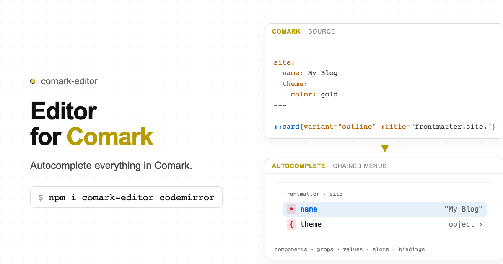

# comark-codemirror

A code editor for [Comark](https://comark.dev) (Component + Markdown), built as [CodeMirror 6](https://codemirror.net) extensions, where you can **autocomplete everything**: components, props, prop values, slots, YAML props, bindings like `{{ frontmatter.title }}`, and every plugin's syntax. Menus chain into each other, so writing a component feels like walking a nested menu.

  



**[Documentation](https://miguelrk.github.io/comark-packages/comark-codemirror/) · [Playground](https://miguelrk.github.io/comark-packages/comark-codemirror/play)**

## Install

```bash
pnpm add comark-codemirror codemirror
```

No runtime dependencies. The CodeMirror packages it builds on (`@codemirror/*`, including `lang-yaml`, and `@lezer/*`) are peer dependencies, installed automatically and shared with your editor. `rangi` and `shiki` are optional peers for their fence-language lists.

## Usage

```ts
import { basicSetup } from 'codemirror'
import { EditorView } from '@codemirror/view'
import { comark } from 'comark-codemirror'
import { presetBuiltins } from 'comark-codemirror/presets/builtins'

new EditorView({
  parent: document.querySelector('#editor')!,
  doc: '# Hello\n',
  extensions: [
    basicSetup,
    comark({
      plugins: presetBuiltins(),
      components: [{
        name: 'card',
        kind: 'block',
        props: { title: { type: 'string', required: true }, variant: { enum: ['soft', 'outline'] } },
        slots: [{ name: 'footer' }],
      }],
      data: { user: { name: 'Ada' } },
    }),
  ],
})
```

`comark()` adds the language (Lezer, with YAML frontmatter and props blocks), chained completion, keymap, lint with quick fixes, hover docs and a CSS-variable theme. Do not pass `autocompletion({ override })`: the completion source is registered through language data.

## Chained autocomplete

```text
::ca|           → ::card{|}            props: title*, variant, flat, .class …
variant ↵       → variant="|"          values: soft, outline
outline ↵       → variant="outline" |  next prop
:ti ↵           → :title="|"           frontmatter, props, data, meta
→ → ↵           → :title="frontmatter.site.name"
```

| Key | While a menu is open |
|---|---|
| <kbd>Enter</kbd> / <kbd>Tab</kbd> | accept; the next menu opens |
| <kbd>→</kbd> / <kbd>←</kbd> | drill in / undo the last chained pick |
| <kbd>{</kbd> <kbd>=</kbd> <kbd>.</kbd> | accept a component, prop or binding key |
| <kbd>Esc</kbd> | end the chain |

Contexts: block menu (`/`), component names, props, bound (`:`) and model (`::`) props, values, classes and ids, slots, YAML props, frontmatter (with a schema), binding paths and fallbacks, fence languages and meta, fence bodies (mermaid, twoslash), emoji, links and heading anchors, footnotes, alerts, tasks, HTML tags and attributes, math commands, and an inline menu.

Coverage is measured: every completable token in comark's 228 SPEC fixtures is offered by the menu (399/399).

## Bindings

Roots match what comark renderers resolve: `frontmatter` (parsed live from the document), `props` (of the enclosing component), `data` and `meta` (from the host, as sample values or JSON Schemas), and component scopes such as `::for` loop variables. Unknown paths are linted with "did you mean".

## Plugins

comark's defaults are registered automatically (alert, attributes, components, frontmatter, html, task-list). Built-ins (`comark-codemirror/presets/builtins`) and ecosystem plugins (`comark-codemirror/presets/ecosystem`: etiket, email, flint, page-break, vega) add components, snippets, scopes, lint and commands. Write your own with `definePlugin`.

## Agents

```ts
import { complete, edit, llms, snapshot, tools } from 'comark-codemirror/agent'

await complete(view.state, pos)   // what is valid here: context and items
tools(view)                       // read, complete, syntax, replace, edit, patch, setText, every command
```

Structural targets (`{ component: 'card', where: { title: 'A' } }`, `{ section: 'Install' }`, `{ slot: 'footer' }`, `{ frontmatter: 'title' }` …), `str_replace` semantics, unified diffs and minimal rewrites. Edits are normal transactions (`userEvent: 'agent'`).

## Component manifests from your code

```ts
// vite.config.ts
import { comarkCodemirrorComponents } from 'comark-codemirror/vite'
export default { plugins: [comarkCodemirrorComponents({ dirs: ['components/content'] })] }

// editor.ts
import components from 'virtual:comark-codemirror/components'
```

## Development

```bash
pnpm test           # node + browser (Chromium; BROWSERS=chromium,firefox,webkit for all)
pnpm bench
pnpm build && pnpm size
pnpm docs           # Docus site with the playground at /play
pnpm gen:docs       # regenerate plugin and command reference pages
```

The original design is in [PRD.md](./PRD.md).

## License

MIT
