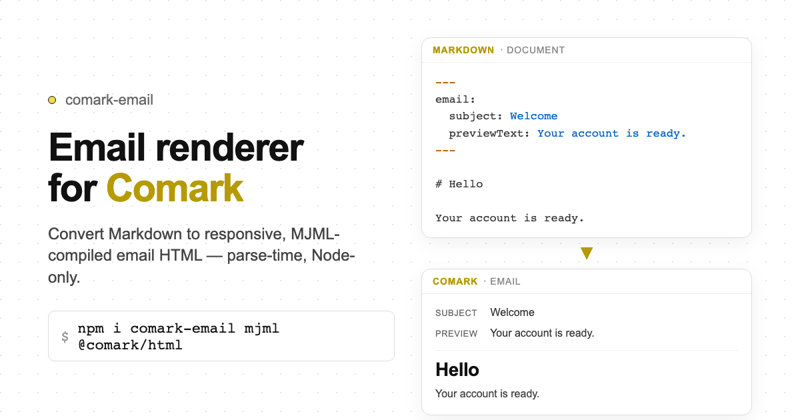

# comark-email

Email renderer for Comark. Convert Markdown to responsive, MJML-compiled HTML for email clients.

   



> **Node.js only.** MJML compiles on the server. Do not import `comark-email` in browser-only bundles.

## Install

```bash
pnpm add comark-email
```

`comark` and `@comark/html` are peer dependencies. `mjml` is a dependency.

## Usage

### Render to email HTML

```typescript
import { renderEmail } from 'comark-email'

const { html, text, subject, previewText } = await renderEmail(`
---
email:
  subject: "Your order has shipped!"
  previewText: "Track your package delivery status."
  brandColor: "#0066cc"
---

# Order Shipped

Your order is on its way.

::email-button{href="https://example.com/track" background-color="#0066cc" color="#ffffff"}
Track Package
::
`)

// Pass html directly to your email provider
await sendEmail({ to: user.email, subject, html, text })
```

### Reusable renderer

```typescript
import { createEmailRenderer } from 'comark-email'

const render = createEmailRenderer({
  email: { brandColor: '#0066cc' },
})

const result = await render(markdownString)
```

### From a pre-parsed document

```typescript
import { parseMarkdown } from 'comark'
import { renderEmailFromDocument } from 'comark-email'

const doc = await parseMarkdown('---\nemail:\n  subject: Hello\n---\n# Hi')
const { html, subject } = await renderEmailFromDocument(doc)
```

## Frontmatter configuration

```yaml
---
email:
  subject: "Your order has shipped!"
  previewText: "Track your package delivery status."
  brandColor: "#0066cc"
  theme:
    background: "#f4f5f7"
---
```

Merge order (last write wins): top-level frontmatter aliases → `frontmatter.email` → `options.email`.

## Email components

```markdown
# Send a button

::email-button{href="https://example.com" background-color="#0066cc" color="#ffffff" border-radius="4px"}
Click Here
::

# Multi-column layout

::email-columns
Left column content.

Right column content.
::

# Horizontal divider

::email-divider{border-color="#cccccc"}
::
```

Components map to native MJML tags: `mj-button`, `mj-section`+`mj-column`, `mj-divider`. Use MJML attributes directly.

## Plugins

Pass plugins from `comark` or `@comark/html` via `options.plugins` and `options.components`:

```typescript
import { renderEmail } from 'comark-email'
import math, { Math } from '@comark/html/plugins/math'

const { html } = await renderEmail(markdown, {
  plugins: [math()],
  components: { Math },
})
```

Custom components unknown to the email renderer are rendered via `@comark/html` and wrapped in `mj-raw`.

## Exports

| Entry | Exports |
|---|---|
| `comark-email` | `createEmailRenderer`, `renderEmail`, `renderEmailFromDocument`, `documentToMjml`, `documentToText`, `compileMjml`, types |
| `comark-email/render` | `renderEmailFromDocument`, `documentToMjml`, `documentToText`, `compileMjml`, `documentToMjmlJson`, `serializeMjml` |
| `comark-email/config` | `resolveEmailConfig`, `buildMjmlHead` |
