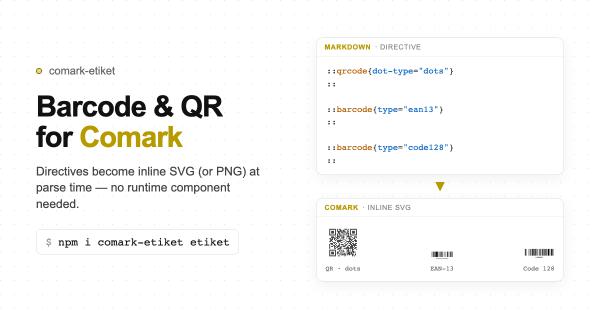

# comark-etiket

A [Comark](https://comark.dev) plugin for [etiket](https://github.com/productdevbook/etiket) barcodes and QR codes — turns directives into inline SVG (or PNG) **at parse time**.

Renderer-agnostic output — no framework component required.

   



## Install

```bash
pnpm add comark-etiket etiket
```

`comark` and `etiket` are peer dependencies.

## Usage

### Plugin only

```ts
import { parseMarkdown } from 'comark'
import etiket from 'comark-etiket'

const tree = await parseMarkdown(content, {
  plugins: [etiket()],
})
```

### Plugin + Vue renderer

No special component required — SVG is injected into the AST:

```vue
<script setup lang="ts">
import { Markdown } from '@comark/vue'
import etiket from 'comark-etiket'
</script>

<template>
  <Suspense>
    <Markdown :plugins="[etiket()]">
      {{ markdown }}
    </Markdown>
  </Suspense>
</template>
```

```md
::qrcode{value="https://comark.dev" dot-type="dots" ec-level="H"}
::

::barcode{value="4006381333931" type="ean13" show-text="true"}
::

::qr-wifi{ssid="GuestNetwork" password="Welcome123"}
::
```

## Feature coverage

🟢 Implemented · 🟡 Partial · ⚪ Out of scope (purposefully not implemented)

| Feature                                                                                                                             | Status | Notes                                                                     |
| ----------------------------------------------------------------------------------------------------------------------------------- | ------ | ------------------------------------------------------------------------- |
| QR Code (`::qrcode`)                                                                                                                | 🟢     | Styling opts (`dot-type`, `ec-level`, gradients, corners, logo) via attrs |
| Micro QR (`::microqr`)                                                                                                              | 🟢     |                                                                           |
| rMQR (`::rmqr`)                                                                                                                     | 🟢     |                                                                           |
| 1D barcodes (`::barcode`)                                                                                                           | 🟢     | All `type=` values etiket supports (EAN, Code 128, GS1-128, …)            |
| Postal (`::postal`)                                                                                                                 | 🟢     | RM4SCC, KIX, AusPost, Japan Post, IMb, …                                  |
| Data Matrix (`::datamatrix`)                                                                                                        | 🟢     |                                                                           |
| GS1 DataMatrix (`::gs1datamatrix`)                                                                                                  | 🟢     |                                                                           |
| PDF417 (`::pdf417`)                                                                                                                 | 🟢     |                                                                           |
| MicroPDF417 (`::micropdf417`)                                                                                                       | 🟢     |                                                                           |
| Aztec (`::aztec`)                                                                                                                   | 🟢     |                                                                           |
| MaxiCode (`::maxicode`)                                                                                                             | 🟢     |                                                                           |
| DotCode (`::dotcode`)                                                                                                               | 🟢     | Experimental in etiket                                                    |
| Han Xin (`::hanxin`)                                                                                                                | 🟢     | Experimental in etiket                                                    |
| Codablock F (`::codablockf`)                                                                                                        | 🟢     |                                                                           |
| Code 16K (`::code16k`)                                                                                                              | 🟢     |                                                                           |
| JAB Code (`::jabcode`)                                                                                                              | 🟡     | SVG only — no PNG in etiket                                               |
| QR helpers (`::qr-wifi`, `::qr-email`, `::qr-sms`, `::qr-geo`, `::qr-url`, `::qr-phone`, `::qr-vcard`, `::qr-mecard`, `::qr-event`) | 🟢     | Payload built from attrs                                                  |
| Swiss QR (`::swiss-qr`)                                                                                                             | 🟢     | Nested fields via JSON attrs / YAML block props                           |
| GS1 Digital Link (`::gs1-digital-link`)                                                                                             | 🟢     | Nested fields via JSON attrs / YAML block props                           |
| Batch sheets (`::barcode-sheet`, `::qr-sheet`)                                                                                      | 🟢     | Values from child lines or `values=` JSON                                 |
| Output `svg` (inline)                                                                                                               | 🟢     | Default. Keeps `currentColor` theming                                     |
| Output `img` (SVG data URI)                                                                                                         | 🟢     |                                                                           |
| Output `png` (PNG data URI)                                                                                                         | 🟡     | All formats except `jabcode`                                              |
| Soft validation                                                                                                                     | 🟢     | `validateBarcode` / `validateQRInput` — warn, still generate              |
| Frontmatter / plugin defaults                                                                                                       | 🟢     | `etiket:` frontmatter + factory `etiket` opts                             |
| Option coercion (kebab → camel, JSON attrs)                                                                                         | 🟢     |                                                                           |
| `qrcodeTerminal` / `output=terminal`                                                                                                | ⚪      | Use etiket directly outside Comark                                        |
| Escape hatch `::etiket{fn=…}`                                                                                                       | ⚪      | Use named directives only                                                 |
| `barcodes()` array helper (no sheet)                                                                                                | ⚪      | Use multiple directives or `::barcode-sheet`                              |
| Raw encoders (`encode*`, `render*SVG`, `render*PNG`)                                                                                | ⚪      | Library-only. Not directive-mappable                                      |
| HIBC / ISBT 128 helpers                                                                                                             | ⚪      | Build payload with etiket, then `::barcode`                               |
| etiket CLI                                                                                                                          | ⚪      | Out of scope for a markdown plugin                                        |

## Directives

### QR Codes

```md
::qrcode{value="https://comark.dev" dot-type="dots" ec-level="H"}
::
```

Supported 2D symbologies: `qrcode`, `microqr`, `rmqr`, `datamatrix`, `gs1datamatrix`, `pdf417`, `micropdf417`, `aztec`, `maxicode`, `dotcode`, `hanxin`, `codablockf`, `code16k`, `jabcode`.

### Barcodes

```md
::barcode{value="4006381333931" type="ean13" show-text="true"}
::
```

The `type=` attribute selects the 1D symbology (e.g. `ean13`, `code128`, `upc-a`, etc.). See the [etiket docs](https://etiket.productdevbook.com) for all supported types.

### Postal codes

```md
::postal{value="SN34RD1A" type="rm4scc"}
::
```

### QR helper directives

| Directive            | Required attrs          | Example                                                                       |
| -------------------- | ----------------------- | ----------------------------------------------------------------------------- |
| `::qr-wifi`          | `ssid`, `password`      | `::qr-wifi{ssid="Net" password="pass"}`                                       |
| `::qr-email`         | `address`               | `::qr-email{address="hi@example.com"}`                                        |
| `::qr-sms`           | `phone`                 | `::qr-sms{phone="+1234567890" message="Hello"}`                               |
| `::qr-geo`           | `lat`, `lng`            | `::qr-geo{lat="48.8584" lng="2.2945"}`                                        |
| `::qr-url`           | `url`                   | `::qr-url{url="https://example.com"}`                                         |
| `::qr-phone`         | `phone`                 | `::qr-phone{phone="+1234567890"}`                                             |
| `::qr-vcard`         | contact fields          | `::qr-vcard{first-name="Ada" last-name="Lovelace" email="ada@example.com"}`   |
| `::qr-mecard`        | contact fields          | `::qr-mecard{name="Ada Lovelace" phone="+1234567890"}`                        |
| `::qr-event`         | `title`, `start`, `end` | `::qr-event{title="Meeting" start="20250101T090000Z" end="20250101T100000Z"}` |
| `::swiss-qr`         | structured fields       | see [Swiss QR Bill](https://etiket.productdevbook.com)                        |
| `::gs1-digital-link` | structured fields       | see [GS1 Digital Link](https://etiket.productdevbook.com)                     |

### Batch sheet directives

```md
::barcode-sheet{type="ean13"}
4006381333931
9780141036144
::

::qr-sheet
https://comark.dev
https://example.com
::
```

Values can also be provided as a JSON array via the `values=` attr:

```md
::barcode-sheet{type="code128" values='["SKU-001","SKU-002","SKU-003"]'}
::
```

## Value sources

- `value=` attribute: `::qrcode{value="https://example.com"}`
- Inline content: `:qrcode[https://example.com]`
- Block body (text children):
  ```md
  ::qrcode
  https://example.com
  ::
  ```

## Option coercion

Attribute names are automatically converted from kebab-case to camelCase:

| Markdown attr                   | etiket option                        |
| ------------------------------- | ------------------------------------ |
| `dot-type="dots"`               | `{ dotType: 'dots' }`                |
| `ec-level="H"`                  | `{ ecLevel: 'H' }`                   |
| `show-text="true"`              | `{ showText: true }`                 |
| `bar-width="2"`                 | `{ barWidth: 2 }`                    |
| `color='{"type":"linear",...}'` | `{ color: { type: 'linear', ... } }` |

## Output modes

Control the generated node type with the `output=` attr or a frontmatter default:

| Mode            | Generated node                        | Notes                               |
| --------------- | ------------------------------------- | ----------------------------------- |
| `svg` (default) | inline `<svg>`                        | Supports CSS `currentColor` theming |
| `img`           | ``    | Portable single element             |
| `png`           | `` | Not available for `jabcode`         |

## Frontmatter defaults

Set global defaults in the document frontmatter under the `etiket` key. Per-directive attrs always take precedence.

```markdown
---
etiket:
  output: svg
  ecLevel: H
  color: currentColor
  qrcode:           # per-tag overrides
    dotType: rounded
---

::qrcode{value="https://example.com"}
::
```

## Plugin options

Pass defaults via the plugin factory — frontmatter values override these:

```ts
import etiket from 'comark-etiket'

const plugins = [
  etiket({
    etiket: {
      output: 'svg',
      ecLevel: 'H',
    },
  }),
]
```

## Error handling

The plugin performs soft validation where possible (`validateBarcode`, `validateQRInput`). Invalid inputs emit a `console.warn` but generation is still attempted. Generation errors produce a `<pre class="etiket etiket-error">` fallback node instead of throwing.

## Binding behaviour

Attributes with a `:key` prefix that are runtime binding expressions (e.g. `:value="user.profileUrl"`) cannot be resolved at parse time. Those directive nodes are left unchanged in the AST.

## Credits

Barcode and QR generation is provided by [etiket](https://github.com/productdevbook/etiket) ([MIT](https://github.com/productdevbook/etiket/blob/main/LICENSE)), maintained by [productdevbook](https://github.com/productdevbook). This plugin wraps that library for use with [Comark](https://comark.dev); it does not reimplement the encoders.

## License

[MIT](./LICENSE)
