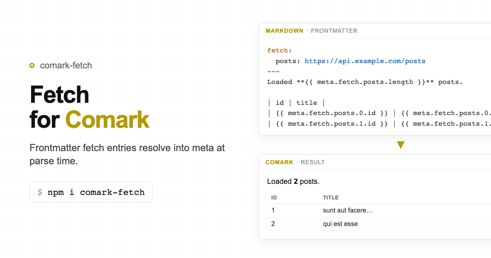

# comark-fetch

A [Comark](https://comark.dev) plugin that declares named HTTP sources in `fetch:` frontmatter and resolves them at **parse time** into `tree.meta.fetch`.

Works for every Comark renderer (HTML, ANSI, Vue, React, Svelte, Angular). No new Markdown syntax: use existing bindings (`{{ meta.fetch.* }}`, `:prop="…"`).

   



## Install

```bash
pnpm add comark-fetch
```

`comark` is a peer dependency.

## Frontmatter

```yaml
---
fetch:
  posts: https://jsonplaceholder.typicode.com/posts   # shorthand → GET

  search:
    url: https://api.example.com/search
    method: POST
    headers:
      content-type: application/json
    body: '{"q":1}'
    staleTime: 60_000
    retry: 2
---
```

Bare strings are shorthand for `{ url: <string>, method: "GET" }`.

### Authoring

```mdc
Loaded **{{ meta.fetch.posts.length }}** posts.

| id | title |
| -- | ----- |
| {{ meta.fetch.posts.0.id }} | {{ meta.fetch.posts.0.title }} |
```

On failure, `meta.fetchErrors.<name>` holds `{ message, url? }`.

## Usage

```ts
import { parseMarkdown } from 'comark'
import fetchPlugin from 'comark-fetch'

const tree = await parseMarkdown(content, {
  plugins: [
    fetchPlugin({
      // Fail closed: empty allowlist denies all origins unless you pass fetch
      allowOrigins: ['https://jsonplaceholder.typicode.com'],
      // allowOrigins: ['*'], // only when document authors are trusted
      // cache: new FetchCache({ defaultStaleTime: 60_000 }),
    }),
  ],
})

tree.meta.fetch?.posts      // JSON payload
tree.meta.fetchErrors?.posts // { message, url } on failure
```

## Security (SSRF)

Frontmatter can trigger outbound HTTP. By default **no origin is allowed**.

| Option | Behavior |
| --- | --- |
| `allowOrigins: []` (default) | Deny, unless a custom `fetch` is supplied |
| `allowOrigins: ['https://api.example.com']` | Allow that origin only |
| `allowOrigins: ['*']` | Allow any `http(s)` origin (trusted authors) |
| `fetch: customFetch` | Host owns the network (allowlist bypassed) |

Default `credentials` is `omit`. The plugin never attaches cookies or auth headers unless the document sets `credentials` / `headers`.

Duplicate keys under `fetch:` fail at parse time (Comark’s YAML parser rejects them; the plugin also scans in `pre()` when frontmatter is otherwise lenient).

## Plugin options

| Option | Type | Default | Notes |
| --- | --- | --- | --- |
| `enabled` | `boolean` | `true` | Disable the whole plugin |
| `allowOrigins` | `string[]` | `[]` | SSRF allowlist |
| `fetch` | `typeof fetch` | `globalThis.fetch` | Custom fetch |
| `cache` | `FetchCache` | process singleton | Optional parse-time cache |
| `throwOnError` | `boolean` | `false` | Fail parse on fetch error |

Per-entry options (frontmatter): `staleTime`, `gcTime`, `retry`, `enabled`, plus transport fields (`method`, `headers`, `body`, `credentials`).

## Development

```bash
pnpm install
pnpm test
pnpm play:nuxt
pnpm build
```

## License

[MIT](./LICENSE)
