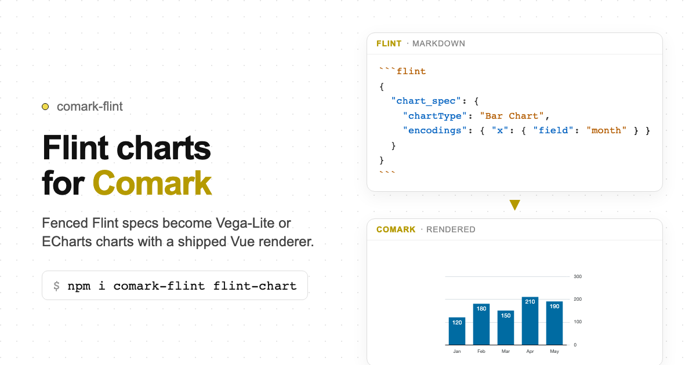

# comark-flint

A [Comark](https://comark.dev) plugin for [Flint](https://github.com/microsoft/flint-chart) charts — compiles Flint specs into backend-native charts and emits a `<Flint>` component node.

Ships a Vue renderer; parse-time SVG/img is an **opt-in** for static docs.

   



## Install

```bash
pnpm add comark-flint flint-chart
```

`comark` and `flint-chart` are peer dependencies.

For the Vue renderer:

```bash
pnpm add vue @comark/vue vega-embed vega vega-lite
# optional ECharts backend:
pnpm add echarts
```

Parse-time `svg` / `img` output is **opt-in** (`output: 'svg'` or `output: 'img'`). Default `output: 'component'` needs the client `<Flint>` renderer. For static SVG/img without Vue, install `vega` + `vega-lite` (and/or `echarts`) as peers.

## Usage

### Plugin only (static docs)

```ts
import { parseMarkdown } from 'comark'
import flint from 'comark-flint'

const tree = await parseMarkdown(content, {
  plugins: [flint({ flint: { output: 'svg' } })],
})
```

With `output: 'component'` (default) and no framework renderer, the AST still contains `<Flint>` nodes — register a renderer (or use the shipped Vue one) to display them.

### Plugin + Vue renderer (recommended for apps)

```vue
<script setup lang="ts">
import { Markdown } from '@comark/vue'
import flint, { Flint } from 'comark-flint/vue'
</script>

<template>
  <Suspense>
    <Markdown :plugins="[flint()]" :components="{ Flint }">
      {{ markdown }}
    </Markdown>
  </Suspense>
</template>
```

## Dual syntax

Both entry points compile to the same `<Flint>` AST node.

### Fenced code block — literal, static spec

````md
```flint backend="vegalite" theme="economist"
{
  "data": { "values": [{ "month": "Jan", "revenue": 120000 }, ...] },
  "semantic_types": { "month": "Time", "revenue": "Money" },
  "chart_spec": {
    "chartType": "Bar Chart",
    "encodings": {
      "x": { "field": "month" },
      "y": { "field": "revenue" }
    },
    "baseSize": { "width": 560, "height": 320 }
  }
}
```
````

The fenced block content is a [`ChartAssemblyInput`](https://github.com/microsoft/flint-chart) JSON string. Backend and theme are Comark fence `meta` key=value tokens (`backend="…" theme="…"`). Curly braces in the info string are line highlights, not chart attrs.

### Component directive — dynamic, bound spec

```md
::flint{:spec="dashboard.kpiChart" backend="vegalite" theme="swiss"}
::
```

`:spec="path.to.spec"` is a Comark binding expression. The plugin resolves the dotted path against the document frontmatter at parse time. Unresolvable paths (runtime data bindings) are left unchanged in the AST so the renderer can evaluate them at request time. Non-prefixed attrs (`backend="…"`) are always treated as literal strings, consistent with Comark's binding plugin behaviour.

## `<Flint>` component props

Props accepted by the shipped Vue renderer (match the attrs the plugin writes on the AST node):

| Prop | Type | Default | Description |
| --- | --- | --- | --- |
| `spec` | `unknown` | — | Compiled backend-native chart spec |
| `backend` | `string` | `'vegalite'` | `vegalite` · `echarts` (others soft-fail with a visible error) |
| `width` | `number \| string` | `400` | Chart canvas width (px) |
| `height` | `number \| string` | `300` | Chart canvas height (px) |
| `theme` | `string \| object` | — | Theme name/object (already applied at compile time; passthrough) |
| `input` | `unknown` | — | Original Flint `ChartAssemblyInput` (passthrough) |
| `class` | `string` | `''` | Extra CSS classes on the wrapper |

Render failures soft-fail into a visible `.flint-error` alert — they do not throw into the page.

## Backends

| Backend | Flint assembler | SSR rendering | Optional peers |
| --- | --- | --- | --- |
| `vegalite` (default) | `assembleVegaLite` | ✅ | `vega` + `vega-lite` (+ `vega-embed` for Vue) |
| `echarts` | `assembleECharts` | ✅ | `echarts` |
| `chartjs` | `assembleChartjs` | ❌ component only | — |
| `plotly` | `assemblePlotly` | ❌ component only | — |
| `excel` | `assembleExcel` | ❌ component only | — |

## ChartAssemblyInput reference

The fenced block content and the `spec` attr value must be a valid [`ChartAssemblyInput`](https://github.com/microsoft/flint-chart) JSON object. Top-level fields:

| Field | Type | Required | Description |
| --- | --- | --- | --- |
| `data` | `{ values?: Row[]; url?: string }` | ✅ | Data source |
| `semantic_types` | `Record<string, string>` | — | Per-field semantic type hints (`Quantity`, `Time`, `Country`, …) |
| `chart_spec` | `{ chartType, encodings, baseSize, … }` | ✅ | Chart definition |
| `theme_spec` | `string \| ThemeSpec` | — | Visual theme — overrides the `theme` attr when present |

The `theme` attr and frontmatter `flint.theme` are injected into `theme_spec` before assembly. A value already present in `theme_spec` inside the JSON spec takes precedence.

## Output modes

| Mode | Generated node | Notes |
| --- | --- | --- |
| `component` (default) | `<Flint spec={…} backend="…">` | Recommended for apps; pair with shipped Vue renderer |
| `svg` | inline `<svg>` | **Opt-in** for static/PDF; requires renderer peer; falls back to `component` |
| `img` | `` | **Opt-in**; requires renderer peer |

## Frontmatter defaults

Set global defaults in the document frontmatter under the `flint` key. Per-directive attrs always take precedence.

```markdown
---
flint:
  backend: vegalite
  theme: economist
  output: component
  width: 560
  height: 320
---

::flint{spec='{"chart_spec":{"chartType":"Bar Chart",...}}'}
::
```

## Plugin options

Pass defaults via the plugin factory — frontmatter values override these:

```ts
import flint from 'comark-flint'

const plugins = [
  flint({
    flint: {
      backend: 'vegalite',
      theme: 'economist',
      output: 'component',
      width: 560,
      height: 320,
    },
  }),
]
```

## Binding behaviour

| Syntax | Behaviour |
| --- | --- |
| `spec='{"…"}'` | Literal JSON — compiled at parse time |
| `:spec="path.to.spec"` | Dotted frontmatter path — resolved at parse time |
| `:spec="live.data"` (missing) | Left unchanged — resolved by renderer at request time |
| `backend="vegalite"` | Literal string — always |
| `theme="economist"` | Literal string — always |

## Credits

Chart compilation is provided by [flint-chart](https://github.com/microsoft/flint-chart) ([MIT](https://github.com/microsoft/flint-chart/blob/main/LICENSE)), built by Microsoft Research. This plugin wraps that library for use with [Comark](https://comark.dev); it does not reimplement the chart assemblers.

## License

[MIT](./LICENSE)
