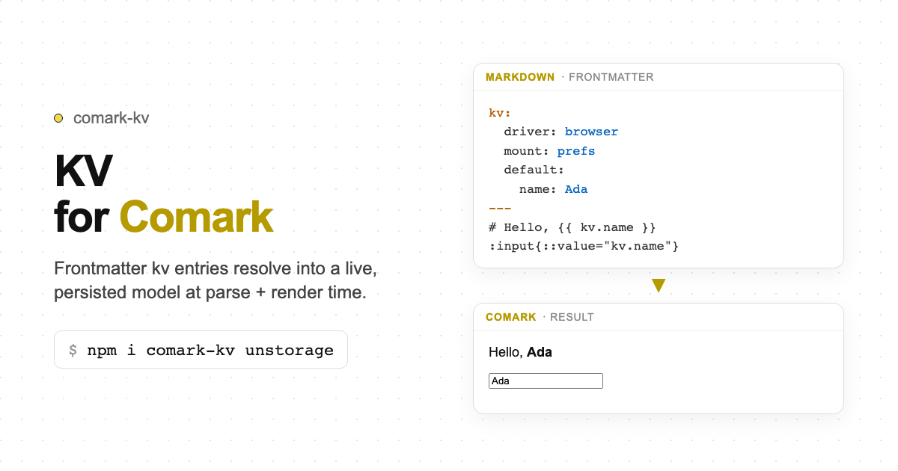

# comark-kv

> The live model (`comark-kv/model`, `comark-kv/vue`) imports `comark/model`. That subpath is not in `comark@0.7.0`. Parse-time frontmatter still typechecks. The model layer needs a newer `comark` that exports `./model`.

A [Comark](https://comark.dev) plugin that declares a `kv:` block in frontmatter,
backed by [unstorage](https://unstorage.unjs.io), and exposes a live writable
`kv.*` namespace for two-way `::prop` model binding.

Two forms are supported:

| Form | Frontmatter | Model paths |
|------|-------------|-------------|
| **Single-driver** | `kv: { driver, mount, default }` | `kv.key` |
| **Multi-driver** | `kv: { ns: { driver, mount, default } }` | `kv.ns.key` |

   



## Install

```bash
pnpm add comark-kv unstorage
```

`comark` (with `comark/model`) is a peer dependency. `vue` is an optional peer
for the `comark-kv/vue` composable.

## Frontmatter

### Single-driver form

One storage backend. Model paths are `kv.<key>`.

```yaml
---
kv:
  driver: browser        # browser | memory | http | …
  mount: prefs           # storage key prefix (default: kv)
  base: /api/kv          # required when driver is http
  default:               # used only when a key is absent in storage
    name: Ada
    subscribed: false
---

# Hello, {{ kv.name }}

:input{::value="kv.name" placeholder="Your name"}
:input{::checked="kv.subscribed" type="checkbox"} Subscribe
```

### Multi-driver form

Each key in the `kv:` map is a **namespace** with its own driver.
Model paths are `kv.<namespace>.<key>` (or `kv.<namespace>` for http URL resources).

A string value is a **shortcut** for the `http` driver with `resource: true`.

**Example — todo desk** (three drivers in one document):

| Namespace | Driver | Why |
|-----------|--------|-----|
| `config` | `browser` (localStorage) | User name + dark/light mode survive reloads |
| `draft` | `memory` | New-todo form fields die with the tab |
| `todos` | `http` shortcut | Remote checklist from an API |

```yaml
---
kv:
  config:
    driver: browser
    mount: user-config
    default:
      name: Ada
      dark: false
  draft:
    driver: memory
    mount: compose
    default:
      todo: ""
      completed: false
  todos: https://jsonplaceholder.typicode.com/todos?_limit=5
---

# Todo desk

Hello **{{ kv.config.name }}**.

:input{::value="kv.config.name" placeholder="Your name"}
:input{::checked="kv.config.dark" type="checkbox"} Dark mode

## New todo

::form{::value="kv.draft" method="POST" url="https://jsonplaceholder.typicode.com/todos"}
  :input{::value="kv.draft.todo" name="title" placeholder="What needs doing?"}
  :input{::checked="kv.draft.completed" name="completed" type="checkbox"} Mark as completed
  ::button[Add todo]{type="submit"}
  ::
::

## Todos

:input{::checked="kv.todos.0.completed" type="checkbox"} {{ kv.todos.0.title }}
:input{::checked="kv.todos.1.completed" type="checkbox"} {{ kv.todos.1.title }}
```

Equivalent long form for the http resource:

```yaml
todos:
  driver: http
  mount: todos
  base: https://jsonplaceholder.typicode.com/todos?_limit=5
  resource: true
```

## Usage

### Parse plugin

```ts
import { parseMarkdown } from 'comark'
import kv from 'comark-kv'

const tree = await parseMarkdown(content, {
  plugins: [kv()],
})
// tree.meta.kv → KvDescriptor (single) or KvNamespaceMap (multi)
```

### Runtime model (framework-agnostic)

```ts
import { createKvModel, isSingleDriverSchema } from 'comark-kv/model'

const { model, ready, dispose, storages } = await createKvModel(tree.meta.kv!)
await ready

// Single-driver
model.get('kv.name')
model.set('kv.name', 'Bob')

// Multi-driver
model.get('kv.config.name')
model.set('kv.config.name', 'Bob')

// HTTP URL shortcut (resource namespace)
model.get('kv.todos')           // remote JSON
model.get('kv.todos.0.title')   // nested path into the resource

// Access individual storages for advanced use / testing
storages['config'].getItem('user-config:name')

dispose()
```

### Vue

```vue
<script setup lang="ts">
import { parseMarkdown } from 'comark'
import kv from 'comark-kv'
import { useKvModel } from 'comark-kv/vue'

const tree = await parseMarkdown(markdown, { plugins: [kv()] })
const { model, ready } = useKvModel(tree)
await ready
</script>

<template>
  <Markdown :value="tree" :model="model" />
</template>
```

### Injecting drivers (testing / SSR)

Use `options.driver` for single-driver, `options.drivers` for multi-driver:

```ts
import memory from 'unstorage/drivers/memory'

// Single
const handle = await createKvModel(descriptor, { driver: memory() })

// Multi
const handle = await createKvModel(map, {
  drivers: {
    local: memory(),
    session: memory(),
  },
})
```

## Type helpers

```ts
import { isSingleDriverSchema } from 'comark-kv'

if (isSingleDriverSchema(tree.meta.kv!)) {
  // KvDescriptor — paths kv.key
} else {
  // KvNamespaceMap — paths kv.ns.key
}
```

## Conflict handling

`storage.watch` reports whole-key changes. Object-valued keys use last-write-wins
at the whole-value level (not field-level merge). Each namespace's writes are
independent and roll back only that namespace on persistence failure.

## License

[MIT](./LICENSE)
