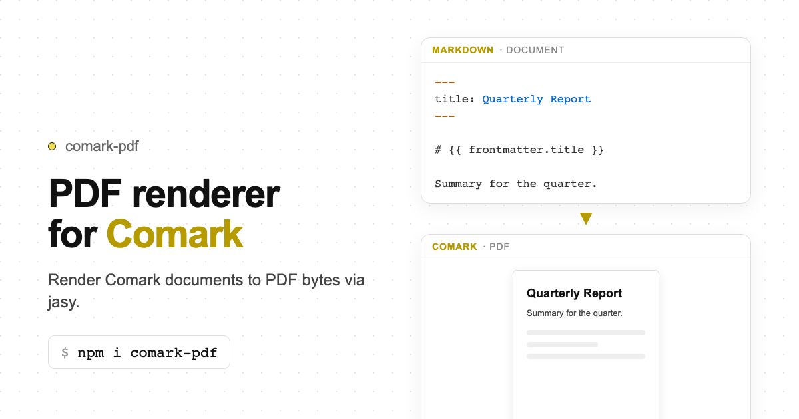

# comark-pdf

PDF renderer for [Comark](https://comark.dev). Convert Markdown to print-ready PDF bytes via [jasy](https://jasy.dev) — no headless browser required.

   



## Install

```bash
pnpm add comark-pdf
```

`comark` is a peer dependency.

## Usage

### Render to PDF bytes

```ts
import { renderPdf, createPdfRenderer } from 'comark-pdf'
import { writeFile } from 'node:fs/promises'

// One-shot
const bytes = await renderPdf(`
---
pdf:
  format: A4
  margin: 20mm
  footer: "Page {{ page }} of {{ totalPages }}"
---

# My Document

Content here.

::page-break
::

# Chapter 2

More content.
`)

await writeFile('output.pdf', bytes)

// Reusable renderer (parser initialized once)
const render = createPdfRenderer({
  pdf: { format: 'A4', margin: '20mm', footer: 'Page {{ page }} of {{ totalPages }}' },
})
const bytes2 = await render(markdownString)
```

### Node.js file export

```ts
import { renderPdfToBuffer, renderPdfToFile } from 'comark-pdf/node'

const buffer = await renderPdfToBuffer(markdown)
await writeFile('output.pdf', buffer)

// Or write directly to a file
await renderPdfToFile(markdown, 'output.pdf')
```

### Browser preview

```ts
import { renderPdf } from 'comark-pdf'
import { mount } from 'comark-pdf/preview'

const bytes = await renderPdf(markdownString)
const handle = mount(document.getElementById('preview'), bytes)

// Later, to free the Blob URL:
handle.revoke()
```

## Locale files

The library does not own template files. Hosts pick one markdown file per locale (`en/`, `es/`). Bind only the locale key that the file owns: `{{ data.sheet.tradeName.en }}` in the English file, `{{ data.sheet.tradeName.es }}` in the Spanish file. Do not write `||` locale fallbacks. A missing value renders empty.

Do not use `::kv`. Write labels in the locale file (GFM tables, `::if`, `::for`). Use `::include` only for a stored markdown string. Do not use `[meta.locale]`.

## Options

`renderPdf()`, `createPdfRenderer()`, and the Node helpers accept `PdfRendererOptions`:

| Option | Type | Description |
| --- | --- | --- |
| `pdf` | `PdfPageConfig` | Page size, margins, typography, metadata. String `header` / `footer` compile into chrome. |
| `chrome` | `PdfChrome` | Page header, footer, and watermark elements. Replaces compiled string templates. |
| `visuals` | `PdfVisuals` | Print faces and table / quote / image map |
| `plugins` | `ComarkPlugin[]` | Parser plugins (math, mermaid, binding, …) |
| `components` | `Record<string, JasyComponentFn>` | Custom jasy component factories by tag name |
| `fonts` | `Record<string, Uint8Array \| FontFaces>` | Font paths or bytes; registered with `addFont` |

Also accepts Comark `ParserOptions` (`autoClose`, `linkify`, `registerDefaultPlugins`, …).

Merge order for page config (last write wins): `frontmatter.pdf` → `options.pdf`.

### `pdf` / frontmatter

Set defaults in code via `options.pdf`, or per document under a `pdf:` frontmatter block (same keys):

```yaml
---
pdf:
  format: A4          # page size (A4, Letter, A3, A5, …); ignored when width + height are set
  width: 50mm         # custom page width (pair with height)
  height: 65mm        # custom page height (pair with width)
  orientation: portrait  # portrait | landscape
  margin: 20mm        # length string, points number, or { top, right, bottom, left }
  gap: 10             # space between block children (points)
  justify: start      # page main-axis alignment
  align: start        # page cross-axis alignment
  font: Helvetica     # document default font
  fontSize: 11        # document default text size (points)
  color: "#1b2433"    # document default text color
  lineHeight: 1.5     # document default line-height
  textAlign: left     # document default text align
  title: "My Report"  # PDF metadata + accessibility title
  author: "Acme"
  lang: en-US
  accessible: false
  onOverflow: error   # error | warn | ignore
  header: "My Report" # compiles to chrome.header; tokens: {{ page }}, {{ totalPages }}
  headerLeft: "Draft"
  headerRight: "Confidential"
  footer: "Page {{ page }} of {{ totalPages }}"
  footerLeft: "Company Name"
  footerRight: "2026"
---
```

`margin` is the paper inset only. Header and footer sit inside that box and take their own height. Do not add chrome height into `margin`. Pass `chrome.header` / `chrome.footer` to replace the compiled strings. Pass `chrome.watermark` as a `Positioned` overlay; it is not part of the header band.

Length values accept `mm`, `cm`, `in`, `pt`, `px`, or a bare number (treated as points).

```ts
const bytes = await renderPdf(markdown, {
  pdf: {
    format: 'Letter',
    margin: '25mm',
    footer: 'Page {{ page }} of {{ totalPages }}',
  },
})
```

## Feature matrix

Three layers, one job each:

| Layer | Job |
| --- | --- |
| [Comark](https://comark.dev) | Parse markdown to an AST. |
| `comark-pdf` | Read that AST. Choose policy. Call jasy primitives. |
| [jasy](https://jasy.dev/docs/pdf) | Draw and lay out PDF primitives. It does not parse Markdown, Mermaid, KaTeX, or Shiki. See [jasy/llms.txt](https://jasy.dev/llms.txt). |

**Status:** `yes` mapped · `fallback` still a valid PDF · `workaround` host-side until jasy grows the primitive · `host` `renderPdf` option, not markdown · `no` not mapped · `jasy` use `@jasy/pdf` (or a custom component) directly.

### Comark syntax → PDF

| Feature | Comark | comark-pdf | jasy |
| --- | --- | --- | --- |
| Frontmatter / `pdf:` | YAML | Merged into page config | `Page` / `Document` props |
| Headings `h1`–`h6` | yes | `Text` + `Bookmark` + `Anchor` (outline) | [`Bookmark`, `Anchor`](https://jasy.dev/docs/pdf/navigation), `Text` |
| Paragraph | yes | `Paragraph` | [`Paragraph` / `Text`](https://jasy.dev/docs/pdf/text) |
| Bold / italic / strike | `**` `_` `~~` | `span` flags | `span({ bold, italic, strikethrough })` |
| Inline code | `` ` `` | `span` Courier | `span({ font: 'Courier' })` |
| `sup` / `sub` | HTML | `span({ verticalAlign })` | `span({ verticalAlign: 'super' \| 'sub' })` |
| Link | `[text](url)` | `span({ href })` | `span({ href })` / `Link` |
| Unordered / ordered list | yes | `Row` marker + `Column` | `Row`, `Column`, `Text` |
| Nested list | yes | Recursive list map | same primitives |
| GFM task list | `- [x]` / `- [ ]` | Printed `[x]` / `[ ]` (Courier). Drops `input`. Does not create AcroForm. | `Text`. `Checkbox` is a form field — not used here. |
| Blockquote | `>` | Tinted `Box` (+ bar when `visuals.quote`) | `Box` |
| Horizontal rule | `---` | `Divider` | `Divider` |
| GFM table | yes | `Table` | `Table` |
| Key-value table | 2-col empty header | `visuals.table.keyValue` → `auto` / `2fr` | `Table({ columns })` |
| Fenced code | yes | Monospace `Box`. Token `color:` → `span` when rangi / Shiki rewrote `pre` | Colored `span` in `Text` |
| Image (default) | `` | Alt-text | — |
| Image embed | same | `visuals.image: 'embed'`: data URI, path, or HTTP fetch (15 s / 8 MB). Fail → alt-text. | [`Image(path \| bytes)`](https://jasy.dev/docs/pdf/images). No `Image(url)` yet. |
| Inline image + embed | `` in a `p` | Workaround: `Column` of text + `Image` + text | Needs an inline-replaced image for in-sentence layout |
| SVG node | HTML `<svg>` | `Svg(sanitizeSvgLengths(…))` | `Svg` |
| `::page-break` | component | `PageBreak()` or `Box({ breakBefore })` | [`PageBreak`, `breakBefore`](https://jasy.dev/docs/pdf/pages) |
| Multi-page flow | long AST | One `Page`; jasy paginates | Automatic pagination |
| Header / footer strings | `pdf.header` / `footer` | Compiled chrome; `{{ page }}` / `{{ totalPages }}` | `Page.header` / `footer`, `PageNumber`, `PageCount` |
| `{{ }}` / `:bind` | binding plugin | Interpolates `data` / `frontmatter` / `props` | — (host data) |
| `::if` / `::for` / `::include` | binding plugin | Built-in jasy components | — |
| Custom `::tag` | Comark component | `components.tag` → `JasyComponentFn` | Any jasy element |
| Math `$…$` / `$$…$$` | math plugin | Optional `mathjax-full` → `Svg`. Else Courier source. | `Svg` |
| Mermaid fence | mermaid plugin | Optional `mermaid` (+ DOM / `happy-dom`) → `Svg`. Else source box. | `Svg` |
| Raw HTML as layout | HTML blocks | **no** — flattened / ignored. jasy is not a CSS engine. | **no** — do not ask for `Html()` |
| Page-foot footnotes | not a first-class map | **no** — needs a jasy page-foot / endnote region | Header/footer chrome is the wrong tool |

### Host options (not markdown)

| Feature | comark-pdf | jasy |
| --- | --- | --- |
| Page size / orientation / margin / gap | `pdf.format`, `width`+`height`, `orientation`, `margin`, `gap` | `Page({ size, orientation, margin, gap })` |
| Document type defaults | `pdf.font`, `fontSize`, `color`, `lineHeight`, `textAlign` | `Document({ font, size, … })` |
| Metadata / a11y / overflow | `pdf.title`, `author`, `lang`, `accessible`, `onOverflow` | `renderToBytes` options |
| Encryption | `pdf.encrypt` | AES-256 encrypt options |
| Embedded fonts | `fonts` + `addFont` | `addFont` / `addFontFromUrl` |
| Print faces / ink / table / quote | `visuals` | Host maps faces onto `Text` / `Box` / `Table` |
| Chrome elements | `chrome.header` / `footer` / `watermark` | `Page` header/footer, `Positioned` overlay |
| Missing glyphs | `onMissingGlyphs` | `renderToBytes({ onMissingGlyphs })` |
| Node file export | `comark-pdf/node` | `renderToBytes` + `writeFile` |
| Browser preview | `comark-pdf/preview` `mount` | bytes → Blob URL |

### jasy-only (custom component or call jasy)

These exist in [jasy](https://jasy.dev/docs/pdf) and are not markdown features. Expose them with `components` when a host needs them.

| jasy | Why it stays in jasy |
| --- | --- |
| AcroForm fields (`TextField`, `Checkbox`, `RadioGroup`, `Dropdown`, `ListBox`, `PushButton`, `SignatureField`) | Fillable widgets. Task lists stay printed marks. |
| `fillForm` / `flattenForm` | Edit an existing form PDF |
| `Link` around a box / image | Markdown links are text `span({ href })` |
| `Canvas` | Drawing API, not an AST node |
| `keepTogether`, orphans / widows, `PageBuilder` | Layout policy on the jasy tree |
| `hyphenate`, `direction: 'rtl'`, ligatures / kerning flags | Text engine options; no markdown syntax |
| `@jasy/zugferd` | E-invoice XML + PDF/A-3 — separate package |

A native jasy `Image(url)` (parity with `addFontFromUrl`) would replace the HTTP fetch workaround. A footnote / endnote page region would enable page-foot notes. They are useful, not blockers.

## Plugins

```ts
import { renderPdf } from 'comark-pdf'
import math, { Math } from 'comark-pdf/plugins/math'
import mermaid, { Mermaid } from 'comark-pdf/plugins/mermaid'

const bytes = await renderPdf(markdown, {
  plugins: [math(), mermaid()],
  components: { Math, Mermaid },
})
```

## Custom components

Override any Comark component tag with a jasy element factory:

```ts
import { renderPdf } from 'comark-pdf'
import { Box, Text } from '@jasy/pdf'

const bytes = await renderPdf(markdown, {
  components: {
    alert: ([, attrs, ...children], ctx) =>
      Box({ bg: '#fff3cd', padding: 12, radius: 4 }, ctx.mapNodes(children)),
  },
})
```

## Development

```bash
pnpm install
pnpm test
pnpm play
pnpm play:nuxt
pnpm build
```

## License

[MIT](./LICENSE)
