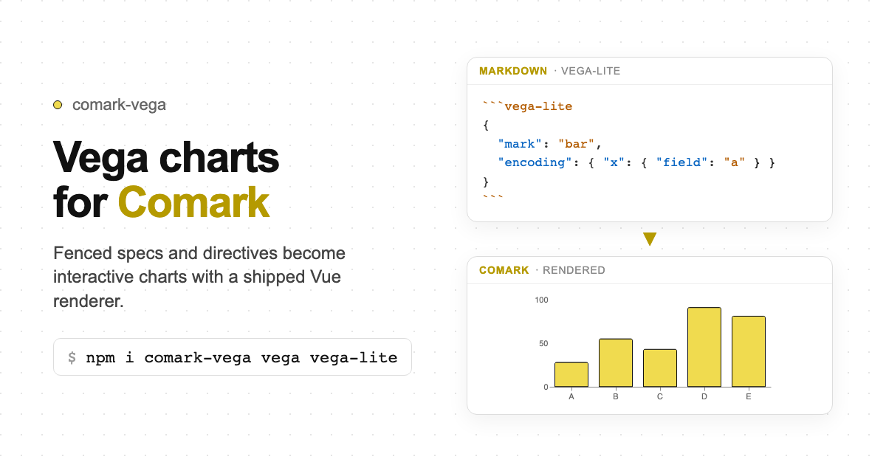

# comark-vega

A [Comark](https://comark.dev) plugin for [Vega](https://vega.github.io/vega/) and [Vega-Lite](https://vega.github.io/vega-lite/) charts — turns fenced blocks and directives into `<Vega>` component nodes.

Ships a Vue renderer; parse-time SVG/img is an **opt-in** for static docs.

   



## Install

```bash
pnpm add comark-vega vega vega-lite
```

`comark`, `vega`, and `vega-lite` are peer dependencies.

For the Vue renderer:

```bash
pnpm add vue @comark/vue
```

`vue` is an optional peer for `comark-vega/vue`.

## Usage

### Plugin only (parse-time SVG / static docs)

```ts
import { parseMarkdown } from 'comark'
import vega from 'comark-vega'

const tree = await parseMarkdown(content, {
  plugins: [vega()],
})
```

Use `::vl`, `::vg`, `::chart`, or mark shortcuts when you want inline SVG at parse time.

### Plugin + Vue renderer (recommended for apps)

```vue
<script setup lang="ts">
import { Markdown } from '@comark/vue'
import vega, { Vega } from 'comark-vega/vue'
</script>

<template>
  <Suspense>
    <Markdown
      :plugins="[vega()]"
      :components="{ Vega }"
    >{{ content }}</Markdown>
  </Suspense>
</template>
```

Then use fenced blocks or `::vega` in Markdown:

````md
```vega-lite
{ "mark": "bar", "data": { "values": […] }, "encoding": { … } }
```
````

```md
::vega{:spec="report.chart" engine="vega-lite"}
```

React / Svelte renderers can follow the same export shape later (`comark-vega/react`, …). Until then, use `mountVegaView` from `comark-vega` (or `comark-vega/vue`) in a custom component.

## Entry points

### 1 — Fenced ````vega` block (literal / static)

Code-fence content is opaque to Comark's parser — `{…}` is never treated as directive attribute syntax, so raw JSON is always safe here. The block is replaced in the AST with a `['Vega', { spec, engine }]` component node.

````md
```vega-lite
{
  "$schema": "https://vega.github.io/schema/vega-lite/v6.json",
  "mark": "bar",
  "data": { "values": [{ "x": "A", "y": 4 }, { "x": "B", "y": 6 }] },
  "encoding": {
    "x": { "field": "x", "type": "nominal" },
    "y": { "field": "y", "type": "quantitative" }
  }
}
```
````

Use ````vega` for a full Vega spec; use ````vega-lite` for a Vega-Lite spec. When `$schema` is present, the engine is auto-detected from the URL regardless of the language tag.

### 2 — `::vega` component directive (dynamic / bound)

`:prop="expression"` attrs are preserved verbatim for `@comark/binding` to resolve against frontmatter or runtime data at render time. Plain `prop="value"` attrs remain literal strings.

```md
::vega{:spec="report.chart" engine="vega-lite"}
```

Multiple bindings are all preserved:

```md
::vega{:spec="dashboard.revenue" :width="panel.w" engine="vega-lite"}
```

A code-fenced body can supply a literal spec when no `:spec` binding is present:

````md
::vega{engine="vega-lite"}
```
{ "mark": "bar", … }
```
::
````

### Shared `<Vega>` component node

Both entry points produce identical `['Vega', VegaNodeAttrs]` AST nodes. Map them with the shipped Vue component (`components="{ Vega }"`) or a custom renderer.

#### Component props

| Prop                    | Type                      | Default | Description                                                                 |
| ----------------------- | ------------------------- | ------- | --------------------------------------------------------------------------- |
| `spec`                  | `Record<string, unknown>` | —       | Literal Vega / Vega-Lite spec (fenced block, body, or binding-resolved)     |
| `engine`                | `'vega-lite' | 'vega'`    | auto    | Chart engine; inferred from `$schema` / structure when omitted              |
| `width`                 | `number | string`         | —       | Chart width in pixels                                                       |
| `height`                | `number | string`         | —       | Chart height in pixels                                                      |
| `output`                | `'svg' | 'img' | 'png'`   | —       | Hint for SSR-capable paths; client `Vega` uses SVG                          |
| `class`                 | `string`                  | `''`    | CSS class on the root element                                               |
| `:spec` / other `:prop` | `string`                  | —       | Binding expressions preserved for `@comark/binding` (resolved before mount) |

Invalid specs soft-fail: the component shows a `<pre class="vega-error">` message and does not throw.

```ts
import type { VegaNodeAttrs } from 'comark-vega'
import { mountVegaView } from 'comark-vega'
```

## Inline-SVG directives

For static output without a runtime component, these directives render the chart as inline SVG at parse time.

### `::vl` — Vega-Lite

The spec JSON must be wrapped in a code fence inside the block body.
Comark reserves `{...}` syntax in block bodies for directive attributes;
a code fence is the only safe way to pass JSON without mangling.

````md
::vl{width="500" height="300" output="svg"}
```
{
  "$schema": "https://vega.github.io/schema/vega-lite/v6.json",
  "mark": "bar",
  "data": {
    "values": [
      { "product": "Valves", "sales": 42000 },
      { "product": "Pipes",  "sales": 31500 }
    ]
  },
  "encoding": {
    "x": { "field": "sales",   "type": "quantitative" },
    "y": { "field": "product", "type": "nominal" }
  }
}
```
::
````

Alias: `::vega-lite`.

### `::vg` — Full Vega

````md
::vg
```
{
  "$schema": "https://vega.github.io/schema/vega/v6.json",
  "width": 300,
  "height": 150,
  "data": [{ "name": "table", "values": [{ "x": "A", "y": 4 }] }],
  "marks": [{ "type": "rect", "from": { "data": "table" }, ... }]
}
```
::
````

> **Note:** `::vega` was previously an alias for `::vg`.
> It is now a separate **component directive** that produces a `<Vega>` node — see [Entry points](#entry-points).
> Use `::vg` for full-Vega inline SVG.

### `::chart` — Auto-detect engine

```md
::chart{engine="vega-lite"}
{ ... }
::
```

Engine is inferred in this order:

1. `engine=` attr (`vega-lite` | `vega`)
2. Directive tag (`::vl` → vega-lite, `::vg` → vega)
3. `$schema` URL in spec
4. Presence of `mark`/`layer`/`hconcat`/… → vega-lite; `marks`/`signals`/… → vega
5. Default: `vega-lite`

### Mark-shortcut directives

Mark shortcuts are sugar over `::vl` that inject the `mark` field when it is absent from the spec body.

| Directive           | Vega-Lite mark |
| ------------------- | -------------- |
| `::chart-arc`       | `"arc"`        |
| `::chart-area`      | `"area"`       |
| `::chart-bar`       | `"bar"`        |
| `::chart-boxplot`   | `"boxplot"`    |
| `::chart-circle`    | `"circle"`     |
| `::chart-errorband` | `"errorband"`  |
| `::chart-errorbar`  | `"errorbar"`   |
| `::chart-geoshape`  | `"geoshape"`   |
| `::chart-image`     | `"image"`      |
| `::chart-line`      | `"line"`       |
| `::chart-point`     | `"point"`      |
| `::chart-rect`      | `"rect"`       |
| `::chart-rule`      | `"rule"`       |
| `::chart-square`    | `"square"`     |
| `::chart-text`      | `"text"`       |
| `::chart-tick`      | `"tick"`       |
| `::chart-trail`     | `"trail"`      |

Example — inline donut chart:

````md
::chart-arc{width="280" height="280"}
```
{
  "data": { "values": [{ "label": "Done", "n": 74 }, { "label": "Todo", "n": 26 }] },
  "encoding": {
    "theta": { "field": "n",     "type": "quantitative" },
    "color": { "field": "label", "type": "nominal" }
  }
}
```
::
````

## Spec sources

### For `<Vega>` component entry points

| Source                     | Syntax                 | Notes                                                                     |
| -------------------------- | ---------------------- | ------------------------------------------------------------------------- |
| Fenced code block          | ````vega-lite … ````   | Literal static spec. Engine auto-detected from `$schema` or language tag. |
| `:spec=` binding attr      | `::vega{:spec="expr"}` | Resolved at render time by `@comark/binding`.                             |
| Code-fenced directive body | `::vega` + ````` body  | Literal spec in directive body (no `:spec` binding present).              |

### For inline-SVG directives

The chart spec is resolved from these sources (in priority order):

1. **Code-fenced block body** — the recommended format.
  Comark treats bare `{...}` in directive block bodies as directive attribute
   syntax. Wrapping the spec in a code fence preserves it as raw text:

````md
::vl
```
{ "mark": "bar", ... }
```
::
````

2. `spec=` **attr** — only reliable for simple, flat specs with at most one level of object nesting. Comark's attr parser may misinterpret nested braces inside quoted attr values.

## Output modes

Control the generated node type with the `output=` attr or a frontmatter default:

| Mode            | Generated node                            | Notes                               |
| --------------- | ----------------------------------------- | ----------------------------------- |
| `svg` (default) | inline `<svg>`                            | Supports CSS `currentColor` theming |
| `img`           | `` | Portable single element             |
| `png`           | ``     | Requires the `canvas` peer dep      |

## Frontmatter defaults

Set global defaults in the document frontmatter under the `vega` key. Per-directive attrs always take precedence.

````markdown
---
vega:
  output: svg
  engine: vega-lite
  width: 600
  height: 300
  scaleFactor: 2
  config:
    background: transparent
    axis:
      grid: false
---

::vl
```
{ ... }
```
::
````

## Plugin options

Pass defaults via the plugin factory — frontmatter values override these:

```ts
import vega from 'comark-vega'

const plugins = [
  vega({
    vega: {
      output: 'svg',
      engine: 'vega-lite',
      width: 500,
      height: 300,
      config: {
        background: null,
      },
    },
  }),
]
```

## Error handling

Invalid specs produce a `<pre class="vega vega-error vega-{tag}">` fallback node instead of throwing, so the rest of the document still renders. A `console.warn` is emitted with the error details.

## Binding behaviour

| Context                                | Behaviour                                                                                                           |
| -------------------------------------- | ------------------------------------------------------------------------------------------------------------------- |
| ````vega` fenced block                 | Content is never processed by the binding pipeline. Always a literal static spec.                                   |
| `::vega{:prop="expr"}`                 | `:prop` bindings are preserved verbatim in the `<Vega>` node for `@comark/binding` to resolve.                      |
| `::vega{prop="value"}`                 | Plain (non-`:`) attrs are coerced to their JS types and stored as literal props.                                    |
| `::vl`, `::vg`, `::chart` (inline-SVG) | `:prop` bindings that contain valid JSON are parsed and applied. Pure expression strings are skipped at parse time. |

## Credits

Chart rendering is provided by [vega](https://github.com/vega/vega) ([BSD-3](https://github.com/vega/vega/blob/main/LICENSE)) and [vega-lite](https://github.com/vega/vega-lite) ([BSD-3](https://github.com/vega/vega-lite/blob/main/LICENSE)), maintained by the [Vega team](https://github.com/vega). This plugin wraps those libraries for use with [Comark](https://comark.dev); it does not reimplement the compilation or rendering logic.

## License

[MIT](./LICENSE)
