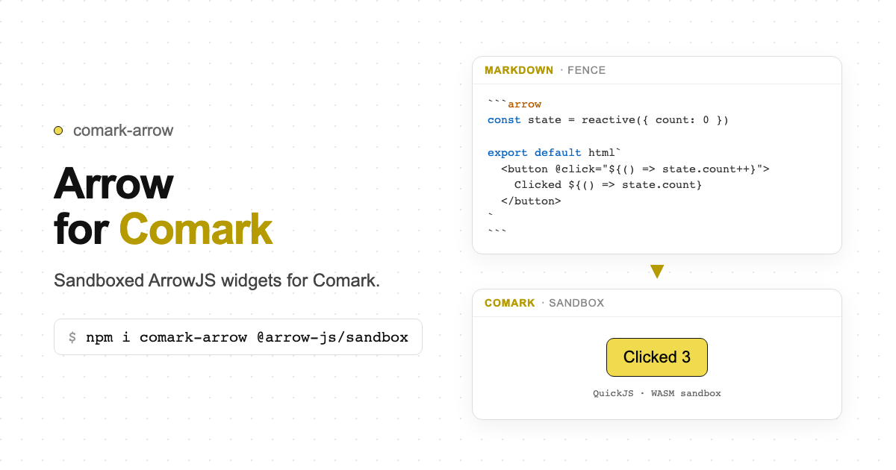

# comark-arrow

A [Comark](https://comark.dev) plugin for [ArrowJS](https://arrow-js.com) sandboxed widgets.

Turn a ` ```arrow ` fence (or `::arrow`) into a live, interactive widget — with **no upfront component registration**. Agent-authored source runs inside `@arrow-js/sandbox` (QuickJS/WASM), not in the host page realm.

   



## Install

```bash
pnpm add comark-arrow @arrow-js/sandbox
```

`comark` is a peer dependency. `@arrow-js/sandbox` is required for the Vue renderer (optional if you only parse).

For the Vue renderer:

```bash
pnpm add vue @comark/vue
```

## Usage

### Plugin only (parse)

```ts
import { parseMarkdown } from 'comark'
import arrow from 'comark-arrow'

const tree = await parseMarkdown(content, {
  plugins: [arrow()],
})
```

### Vue (interactive)

```ts
import arrow, { ArrowSandbox, provideArrowHostBridge } from 'comark-arrow/vue'
// <Markdown :plugins="[arrow()]" :components="{ ArrowSandbox }" />
```

### Fenced block

~~~markdown
```arrow {height="120px"}
const state = reactive({ count: 0 })

export default html`
  <button @click="${() => state.count++}">
    Clicked ${() => state.count}
  </button>
`
```

```arrow-css
button { font: inherit; padding: 0.5rem 1rem; }
```
~~~

Optional adjacent ` ```arrow-css ` supplies `main.css`.

### Bound directive

```markdown
::arrow{:source="widgets.reorderCalculator"}
::
```

Both forms emit the same `['ArrowSandbox', attrs]` AST node.

## Streaming

Comark does not close unterminated code fences. While the host is streaming, pass a getter so the last open fence stays non-executable:

```ts
arrow({ streaming: () => isStreaming.value })
```

Pair with `<Markdown :streaming="isStreaming">`. Incomplete frames get `status: 'pending'`; `<ArrowSandbox>` shows a placeholder and never boots the VM.

## hostBridge

Expose allowlisted host functions to sandboxed code. **Never** put bridge functions on the AST — supply them from the app:

```ts
provideArrowHostBridge({
  'host-bridge:erp': {
    getStockLevel: (sku) => inventory.read(String(sku)),
  },
})
```

```ts
// inside the sandboxed block
import { getStockLevel } from 'host-bridge:erp'
```

Prefer read-only bridge names. Mutating functions are an explicit host opt-in (route writes through a confirmation step in the host app).

## Security

- Agent-authored source runs only inside QuickJS/WASM (R9.1).
- Isolation is **not** correctness — review generated widgets like generated numbers (R9.6).
- Upstream `@arrow-js/sandbox` still bridges a **restricted** `fetch()` (https, no credentials, 15s, 1 MB) and timers. Host cookies and DOM stay unreachable.
- If you use `security({ allowedTags: [...] })`, include `ArrowSandbox` in the allowlist.
- Pin `@arrow-js/sandbox` to `1.0.6` (Early Access). Re-check the API on upgrade.

## Static fallbacks

Non-executing targets (HTML string, ANSI, PDF, email) must not boot the VM:

```ts
import arrow from 'comark-arrow'
import { ArrowSandbox } from 'comark-arrow/html'
// createHtmlRenderer({ plugins: [arrow()], components: { ArrowSandbox } })
```

Fence attr or plugin option `fallback`: `source` | `placeholder` | `caption` (default).

SSR / Nuxt: the Vue component mounts the sandbox only in `onMounted`.

Vite hosts: `@arrow-js/sandbox` does `import ts from 'typescript'`. Pre-bundle TypeScript so the default export works:

```ts
// vite.config / nuxt.config → vite.optimizeDeps
optimizeDeps: {
  include: ['typescript', '@arrow-js/sandbox', 'quickjs-emscripten'],
},
```

## Development

```bash
pnpm install
pnpm play       # tsx playground against the plugin
pnpm play:nuxt  # Nuxt docs + playground site
pnpm test
pnpm build
```

## License

[MIT](./LICENSE)
