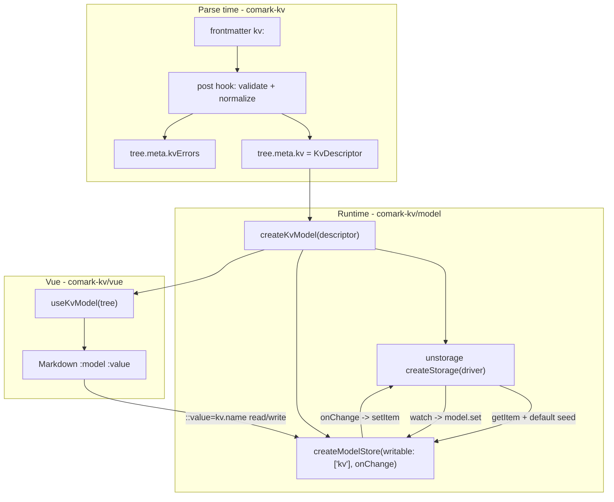

# comark-kv Implementation Plan

## Key constraint discovered

The PRD targets Comark's model/two-way-binding API (`comark/model` -> `createModelStore`, `ComarkModel`, `::value="kv.name"`). That API exists **only in the local monorepo source** at [/Users/mrk/Documents/miguelrk/comark/packages/comark/src/model.ts](/Users/mrk/Documents/miguelrk/comark/packages/comark/src/model.ts) (exported as `comark/model`), not in the published `comark@0.7.0` installed today. Also, **parse plugins have no hook that can touch the model store** — `ComarkPlugin` only exposes `pre`/`post` ([types.ts:374](/Users/mrk/Documents/miguelrk/comark/packages/comark/src/types.ts)). The model is created at render time and accepted via the `model` prop on `<Markdown>` ([Markdown.ts:69,180](/Users/mrk/Documents/miguelrk/comark/packages/comark-vue/src/components/Markdown.ts)).

Therefore comark-kv is split into three layers, per the confirmed decisions (local-monorepo dependency; Vue-first).

## Architecture

## Package + dependency setup

- Keep name `comark-kv`. In [package.json](/Users/mrk/Documents/miguelrk/comark-kv/package.json):
  - Add subpath exports `./model` and `./vue` (mirror [comark-arrow/package.json](/Users/mrk/Documents/miguelrk/comark-arrow/package.json) multi-export shape: `.`, `./vue`, ...).
  - `dependencies`: `unstorage`.
  - `peerDependencies`: `comark` (next/unreleased with model API), `vue: ^3.5.0` (optional via `peerDependenciesMeta`).
  - `devDependencies`: link local monorepo via pnpm `link:` — `comark: link:../comark/packages/comark`, `@comark/vue: link:../comark/packages/comark-vue`; plus `vue`, `@vue/test-utils`, `happy-dom`, `unstorage`.
- Prerequisite: build the local comark packages (`pnpm --filter comark --filter @comark/vue build`, or their `stub`) so `comark/model` and `@comark/vue` resolve at type/runtime.
- [tsdown.config.ts](/Users/mrk/Documents/miguelrk/comark-kv/tsdown.config.ts): multi-entry `['src/index.ts','src/model/index.ts','src/vue/index.ts']`, `deps.neverBundle: ['comark','vue','unstorage']`.

## Source modules (thin plugin + fat modules, matching comark-fetch conventions)

- [src/types.ts](/Users/mrk/Documents/miguelrk/comark-kv/src/types.ts): `KvConfig`, `KvMeta` (`kv?: KvDescriptor`, `kvErrors?: Record<string,string>`), `KvFrontmatter`, `KvDescriptor` (`{ driver, mount, base?, default? }`), `KvDriverName`.
- [src/normalize.ts](/Users/mrk/Documents/miguelrk/comark-kv/src/normalize.ts): `normalizeKv(raw): KvDescriptor` — coerce shorthand, apply `mount` default (`'kv'`), keep `default` object as-is.
- [src/validate.ts](/Users/mrk/Documents/miguelrk/comark-kv/src/validate.ts): `validateKv(desc)` — `driver` required; `mount` string; `default` plain object; require `base` when `driver === 'http'`. Returns `{ ok, errors }`.
- [src/duplicates.ts](/Users/mrk/Documents/miguelrk/comark-kv/src/duplicates.ts): raw-markdown dupe guard for keys under `kv.default:` (pattern from [comark-fetch duplicates.ts](/Users/mrk/Documents/miguelrk/comark-fetch/src/duplicates.ts)), thrown in `pre`.
- [src/index.ts](/Users/mrk/Documents/miguelrk/comark-kv/src/index.ts): `defineComarkPlugin<KvConfig, KvMeta>` — `pre` runs dupe guard; `post` reads `state.tree.frontmatter.kv`, normalizes+validates, writes `state.tree.meta.kv` (descriptor) and `state.tree.meta.kvErrors`. **No storage I/O at parse time** (sync + environment-agnostic). Re-export helpers + model/types.

## Runtime module — `comark-kv/model`

- [src/model/drivers.ts](/Users/mrk/Documents/miguelrk/comark-kv/src/model/drivers.ts): driver registry mapping name -> lazy loader: `browser` -> `unstorage/drivers/localstorage`, `memory` -> `unstorage/drivers/memory`, `http` -> `unstorage/drivers/http` (uses `base`). Support injected custom drivers via options.
- [src/model/index.ts](/Users/mrk/Documents/miguelrk/comark-kv/src/model/index.ts): `createKvModel(descriptor, opts?) -> { model: ComarkModel, ready: Promise<void>, dispose(): void }`:
  - Build `storage = createStorage({ driver })`.
  - Seed `createModelStore({ data: { kv: { ...default } }, writable: ['kv'], onChange })` so SSR/first paint has `default` values. Namespace root is fixed `kv`; `mount` is only the storage-key prefix (`mount:key`).
  - **Hydrate** (async, `ready`): for each key, `storage.getItem(mount:key)`; if present `model.set('kv.'+key, value)`, else persist the default. Use an `applyingExternal` guard so hydration/watch-origin writes skip re-persisting (avoid echo loop).
  - **Local write**: `onChange(path, value)` -> `storage.setItem(mount:key, value)`; on failure roll back via a shadow `lastKnown` map + `model.set(path, prev)` (best-effort; documented).
  - **External write**: `storage.watch((_, key) => model.set('kv.'+unprefix(key), await storage.getItem(key)))` under the guard. Whole-key last-write-wins (PRD conflict note).
  - Writes route through guarded `model.set` (namespace + prototype-pollution guards in [utils set()](/Users/mrk/Documents/miguelrk/comark/packages/comark/src/utils/index.ts)).

## Vue module — `comark-kv/vue`

- [src/vue/index.ts](/Users/mrk/Documents/miguelrk/comark-kv/src/vue/index.ts): `useKvModel(tree, opts?)` — reads `tree.meta.kv`, calls `createKvModel`, returns the `ComarkModel` (and optionally `ready`), and `onUnmounted` -> `dispose()`. Host passes it as `<Markdown :value="tree" :model="model">`.

## Tests

- [test/plugin.test.ts](/Users/mrk/Documents/miguelrk/comark-kv/test/plugin.test.ts): `parseMarkdown` -> assert `meta.kv` normalization (mount default), validation errors into `meta.kvErrors`, dupe-key throw.
- [test/model.test.ts](/Users/mrk/Documents/miguelrk/comark-kv/test/model.test.ts): memory driver — default hydration, write -> `getItem` persisted, external `setItem` -> subscriber notified, failing storage -> rollback, no echo loop.
- Optional Vue test (happy-dom + `@vue/test-utils`, like [comark-arrow test](/Users/mrk/Documents/miguelrk/comark-arrow/test/plugin.test.ts)) for `useKvModel` wiring.

## Playground

- [playground/app/pages/play.vue](/Users/mrk/Documents/miguelrk/comark-kv/playground/app/pages/play.vue): frontmatter `kv: { driver: memory|browser, mount: prefs, default: { name: Ada, subscribed: false } }`; body `# Hello, {{ kv.name }}` + `:input{::value="kv.name"}` + `:input{::checked="kv.subscribed" type="checkbox"}`. Wire by parsing to a document, `const model = useKvModel(tree)`, then `<Markdown :value="tree" :model="model" :plugins="[kv()]">`.
- Playground [package.json](/Users/mrk/Documents/miguelrk/comark-kv/playground/package.json): ensure `@comark/vue` (local link) + `unstorage`.

## PRD open questions resolved

- Multiple top-level namespaces: **supported** — use `writable: ['kv']`; keep `kv.*` (no `data.kv.*` fallback needed).
- `mount` default: **default to `kv`** when omitted (namespace root stays `kv`; `mount` only prefixes storage keys).
- SSR hydration boundary: seed model synchronously with `default`; async-hydrate on client and notify; expose `ready`; controlled `model` prop keeps one instance across SSR->client.

## Out of scope (v1, per PRD)

Field-level/CRDT conflict resolution; non-unstorage backends; a public "remote signals" primitive; live two-way in html/ansi (they render static `default` values only).
