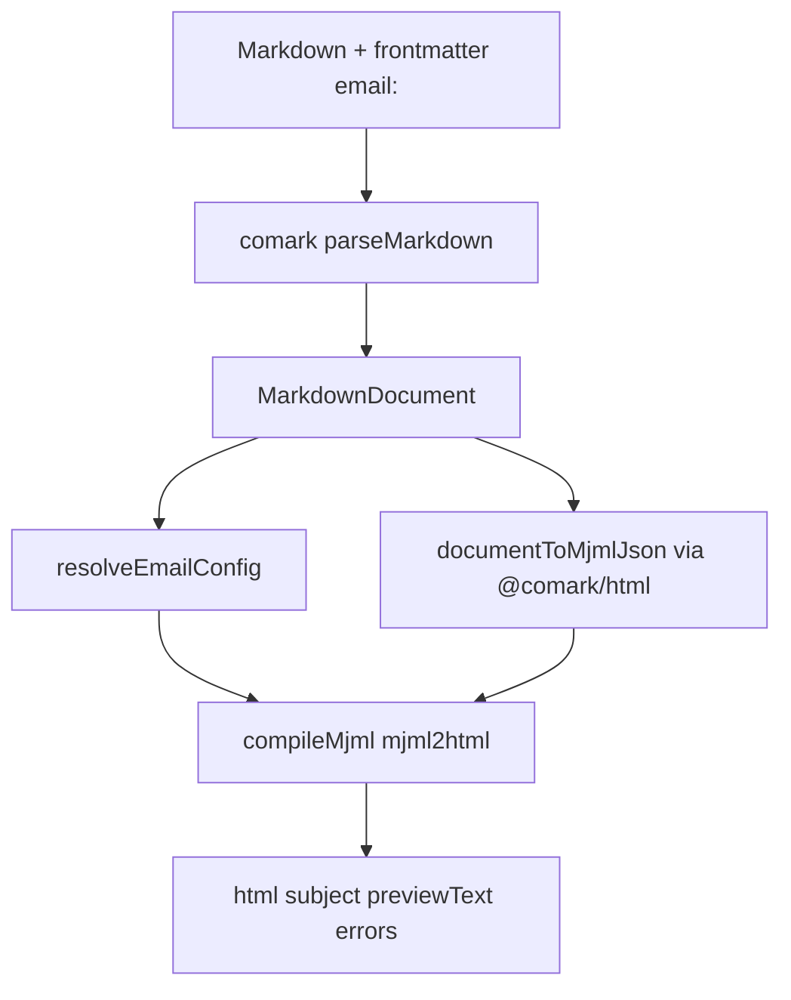

# Port `@comark/email` as third-party `comark-email`

Source of truth: [comarkdown/comark#426](https://github.com/comarkdown/comark/pull/426) (MJML commit `741767e`, branch `miguelrk-issue-425-feature-add-comark-email-renderer-powere-7be465`).

## Decision: renderer, not parse plugin

The current stub in [`src/index.ts`](src/index.ts) copies the `defineComarkPlugin` template. That is the wrong product.

PR 426 is a **document renderer**, same class as `@comark/html`:

- Input: Markdown string or `MarkdownDocument`
- Output: `{ html, subject, previewText, errors }`
- Directives (`::email-button`, `::email-columns`, `::email-divider`) are normal Comark components. The parser already builds those AST tags. The renderer maps them to MJML.

Do **not** keep a default `emailPlugin()` factory. Consumers call `renderEmail()` / `createEmailRenderer()`. Parse plugins stay optional and come from `comark` / `@comark/html`.



## What not to copy from the PR

Leave these in core. They do not belong in this repo:

- Monorepo files: `pnpm-workspace` root, `scripts/sync-plugins.mjs`, `test/bundle.test.ts`, `AGENTS.md`, `docs/content/**`
- Vite example at `examples/2.vite/email` (replace with the existing Nuxt playground)
- Maizzle/Tailwind leftovers and the unimplemented `plugins/shiki` import
- Thin re-exports of `@comark/html/plugins/{binding,math,mermaid}` and `comark/parse` / `comark/utils`
- Default export of no-op parser plugins (keep the MJML **helpers**, not the fake plugin factories)

## Package surface

Keep unscoped name `comark-email`. Expand tsdown to multiple entries, same pattern as [`comark-arrow/tsdown.config.ts`](../comark-arrow/tsdown.config.ts).

**Exports**

- `.` — `createEmailRenderer`, `renderEmail`, types
- `./render` — `renderEmailFromDocument`, `documentToMjml`
- `./config` — `resolveEmailConfig`, `buildMjmlHead`

**Dependencies**

- Peer: `comark` `>=0.4.0`, `@comark/html` `>=0.7.0`
- Peer (optional): `mjml` `>=5` — lazy-loaded in `compileMjml`; throw a clear install error if missing
- Dev: `@types/mjml`, `mjml`, `comark`, `@comark/html`
- tsdown `neverBundle`: `comark`, `@comark/html`, `mjml`

Update [`package.json`](package.json) description, keywords (`mjml`, `renderer`), `comark.tagline` / `comark.install` (`npm i comark-email mjml @comark/html`).

MJML is Node-only. Document that. Do not try to compile in the browser.

## Source layout

Replace the stub. Copy the MJML-era files from the PR, then retarget imports and package names (`@comark/email` → `comark-email`).

```
src/
  index.ts          # createEmailRenderer, renderEmail
  render.ts         # renderEmailFromDocument, documentToMjml
  transform.ts      # AST → MjmlNode (uses @comark/html/render)
  serialize.ts      # MjmlNode → XML
  mjml.ts           # lazy compileMjml
  config.ts         # frontmatter merge + mj-head
  types.ts
  plugins/
    email-button.ts   # emailButtonToMjml only
    email-columns.ts  # emailColumnsToMjml only
    email-divider.ts  # emailDividerToMjml only
```

Delete [`test/plugin.test.ts`](test/plugin.test.ts). Do not add `src/parse.ts`, `src/utils/`, or html-plugin re-exports.

Public API in `index.ts` (same as PR, new package name):

```ts
export const createEmailRenderer = (
  options?: EmailRendererOptions,
): ((markdown: string) => Promise<EmailRenderResult>) => {
  const parseMarkdown = createMarkdownParser(options)
  return async (markdown) => {
    const document = await parseMarkdown(markdown)
    return renderEmailFromDocument(document, options)
  }
}

export const renderEmail = (markdown: string, options?: EmailRendererOptions) =>
  createEmailRenderer(options)(markdown)
```

`render.ts` must keep `export * from 'comark/render'` only if a first-party consumer needs it. For this package, **do not** re-export `comark/render`. Callers already have `comark`.

## Apply PR review fixes while porting

These bugs are still in the PR head. Fix them here.

1. **Config merge** in `config.ts` — documented order is top-level aliases, then `frontmatter.email`, then `options.email`. Today top-level wins. Use:

```ts
subject: opt.subject ?? fmEmail.subject ?? (fm.subject as string | undefined)
```

(same for `previewText` and `brandColor`; then spread remaining `opt` fields / `theme`).

2. **XML escape** in `serialize.ts` — escape `mj-title` and `mj-preview` content (`R&D`). Keep raw HTML for `mj-text` / `mj-raw` / `mj-table`.

3. **Tables** in `transform.ts` — render **children** into `mj-table`, not the outer `<table>`:

```ts
if (tag === 'table') {
  const content = await renderInlineHtml(children, options)
  return [{ tagName: 'mj-table', attributes: {}, content }]
}
```

4. **Error string** in `mjml.ts` — `[@comark/email]` → `[comark-email]`.

5. **No `any`** — type the MJML module import without `any` (use `unknown` + a narrow `Mjml2HtmlFn` check).

## Tests

Port from the PR, then drop the math-plugin case (that plugin is `@comark/html`, not this package).

| File | Role |
|------|------|
| `test/fixtures/markdown.ts` | BASIC / ADVANCED samples |
| `test/index.test.ts` | `renderEmail`, `createEmailRenderer`, `renderEmailFromDocument` |
| `test/config.test.ts` | merge order, `brandColor` fallback, `buildMjmlHead` |
| `test/transform.test.ts` | headings, images, lists, tables (children-only), unknown tags → `mj-raw` |
| `test/email-components.test.ts` | button / columns / divider → MJML tags and compiled HTML |

Keep the existing custom-`components` test so unknown directives still go through `@comark/html`. Add one test that `frontmatter.email.subject` overrides top-level `subject`. Add one test that `mj-table` HTML does not wrap a nested `<table>`.

## Playground (keep Nuxt, do not copy Vite)

MJML cannot run in the browser. The current play page passes a plugin to `<Markdown>`. That path cannot compile email HTML.

**CLI** [`playground/index.ts`](playground/index.ts): call `renderEmail(content)` and log `subject`, `previewText`, `errors`, html length.

**Nuxt**

- Add Nitro route `playground/server/api/render.post.ts`: parse JSON `{ markdown }`, call `renderEmail`, return the result. Cap body size. On failure return HTTP 500 JSON.
- Rewrite [`playground/app/pages/play.vue`](playground/app/pages/play.vue):
  - Left: markdown textarea (ADVANCED fixture as default)
  - Right: subject, preview text, error list, **iframe `srcdoc`**
  - Debounce ~150ms
  - Ignore stale responses (request generation / abort)
- [`playground/package.json`](playground/package.json): add `@comark/html` and `mjml`
- Alias stays on `comark-email` → `../src/index.ts`
- Docs page (`/`) still renders README with `rangi` (HTML docs, not email compile)

Do not add a Vite example. Do not expose `/api/render` without a body limit.

## Docs

Replace [`README.md`](README.md) with the PR README, retargeted:

- Package `comark-email`
- Install `pnpm add comark-email mjml @comark/html`
- Usage examples use named `renderEmail` / `createEmailRenderer`
- Frontmatter `email:` and the three directives
- Node-only note
- Plugin section: pass plugins from `@comark/html` / `comark` into `renderEmail(md, { plugins, components })` — do **not** document `comark-email/plugins/shiki`

Update [`playground/README.md`](playground/README.md) and OG copy (`headline` / `tagline` / install) to match. Regenerate OG with `pnpm og:generate`.

## Verification

From repo root:

1. `pnpm install`
2. `pnpm typecheck`
3. `pnpm test`
4. `pnpm build`
5. `pnpm play` — prints subject / html
6. `pnpm play:nuxt` — edit markdown, confirm iframe HTML, subject, preview text, and that a late response does not overwrite a newer one

Browser check the `/play` flow end to end (type, debounce, button/columns/divider sample). Docs route must still render the README.
