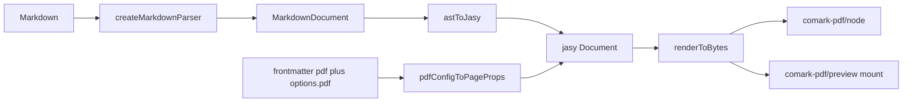

# Port the jasy PDF renderer into comark-pdf

This package must ship a **renderer**, not a parse-time `defineComarkPlugin`. The current stub in [`src/index.ts`](src/index.ts) and the tests in [`test/plugin.test.ts`](test/plugin.test.ts) must go. Keep the third-party repo shape (tsdown, Nuxt playground, peer `comark`). Copy the renderer logic from [PR 424](https://github.com/comarkdown/comark/pull/424) (`@comark/pdf`). Adapt the public name and the entry points.

Engine: [jasy](https://jasy.dev/llms.txt) (`@jasy/pdf`). The package maps a Comark AST to jasy nodes and then calls `renderToBytes`.



## What to keep from the PR

Copy these modules (rename `@comark/pdf` to `comark-pdf` in comments and docs):

- [`src/index.ts`](src/index.ts) — `createPdfRenderer`, `renderPdf`, re-export types and page helpers
- `src/render.ts` — `renderPdfDocument`, `renderPdfBytes`, `renderPdfFromDocument`
- `src/jasy.ts` — AST to jasy map
- `src/page.ts` — lengths, margins, headers/footers, `pdfConfigTo*`
- `src/types.ts` — `PdfPageConfig`, `PdfRendererOptions`
- `src/node.ts` — `renderPdfToBuffer`, `renderPdfToFile` (`node:fs/promises`)
- `src/preview.ts` — browser `mount` (Blob URL iframe)
- `src/plugins/page-break.ts`, `math.ts`, `mermaid.ts`
- Tests: `index`, `node`, `page-break`, `page-config`, preview (happy-dom, not vitest browser)
- Fixtures from the PR (`BASIC_MARKDOWN`, `ADVANCED_MARKDOWN`)

`createPdfRenderer` must keep the PR pattern: call `createMarkdownParser(options)` once, then parse + `renderPdfBytes` on each call. `comark` 0.7 already exports `createMarkdownParser`.

## What not to copy (first-party only)

Do **not** add these first-party convenience re-exports:

- `src/parse.ts` (`export * from 'comark/parse'`)
- `src/utils/index.ts` (`export * from 'comark/utils'`)
- `src/plugins/binding.ts`
- `export * from 'comark/render'` in `render.ts` (that API is HTML)

Users import parse helpers from `comark`. This package only exports PDF render APIs.

Do **not** copy core-monorepo files: Vite example, `docs/rendering/pdf.md`, AGENTS.md, CHANGELOG, bundle tests.

Do **not** add ZUGFeRD / `@jasy/zugferd`.

Do **not** add fillable-form or barcode demo components.

## Package and build

Update [`package.json`](package.json):

- Description and `comark.tagline`: renderer that writes PDF bytes via jasy. Remove “parse time plugin”.
- Keywords: add `renderer`. Keep `pdf`.
- `dependencies`: `@jasy/pdf` at `1.0.0-beta.3` (same as the PR).
- `peerDependencies`: `comark` `>=0.7.0`.
- `devDependencies`: `happy-dom` for preview tests.
- Named exports (no default plugin export):

```ts
".": dist/index
"./node": dist/node
"./preview": dist/preview
"./render": dist/render
"./plugins/*": dist/plugins/*
```

Update [`tsdown.config.ts`](tsdown.config.ts) with matching `entry` files. Keep ESM only. tsdown already treats `comark` and `@jasy/pdf` as external.

Update [`tsconfig.json`](tsconfig.json): add `"DOM"` to `lib` so `src/preview.ts` type-checks.

Style rules for this repo:

- Use `const` arrow functions.
- Do not add extra comments. Keep only comments that hide a non-obvious rule (units, degrade of math/mermaid).
- Do not use `any`. Type jasy trees as `unknown` (or jasy return types if they exist). The PR uses `any`; do not copy that.

## Mapper and defaults (fixes during the port)

Keep the PR map in `jasy.ts` (headings, paragraphs, lists, tables, code boxes, images as alt text, `::page-break`). Apply these fixes:

1. **Inline custom tags.** Pass `ctx` into `mapInlineToSpans`. For an unknown inline tag, if `ctx.components[tag]` exists, call it. Also map inline `img` to italic alt text. Today the PR drops inline math/img.
2. **Register `PageBreak` by default.** Merge `{ 'page-break': PageBreak }` in `createPdfRenderer` / `renderPdfBytes` so `type="before"` works without a user `components` map. User maps still override.
3. **Lengths.** In `parseLengthToPt`: support `px` (`n * 0.75`), keep mm/cm/in/pt, throw if the number is not finite. Do not treat unknown suffixes as points.
4. **Documented page defaults.** `format` already defaults to `A4`. If `margin` is missing, use `20mm` (the README states this; the PR does not apply it).
5. **Preview iframe.** Set `iframe.title` to `PDF preview`.

Keep degraded math/mermaid as in the PR: parse plugin re-export from `comark/plugins/*`, jasy component prints source as Courier text. Do **not** add katex / mermaid as required peers.

## Playground (third-party shape)

The Nuxt docs page stays HTML: [`playground/app/pages/index.vue`](playground/app/pages/index.vue) still renders the README with `@comark/nuxt` `Markdown`.

Change the play page. [`playground/app/pages/play.vue`](playground/app/pages/play.vue) must not use `Markdown` + `pdf()`. It must:

- Keep the markdown textarea and debounce.
- Call `renderPdf` from `comark-pdf` on the client.
- Call `mount` from `comark-pdf/preview` into a full-height box.
- Call `revoke()` on update and on unmount.
- Show a short error string if render fails.

Update [`playground/nuxt.config.ts`](playground/nuxt.config.ts) aliases:

- `comark-pdf` → `../src/index.ts`
- `comark-pdf/preview` → `../src/preview.ts`

Add `@jasy/pdf` so the aliased source can resolve it (root dependency is enough if Vite sees the workspace). Allow parent `fs` (already set).

Change [`playground/index.ts`](playground/index.ts) from `parseMarkdown` + plugin to `renderPdfToFile` (or `renderPdf` + byte length). This is the Node smoke script for `pnpm play`.

Do not add extra demo markdown beyond a short A4 sample with `pdf:` frontmatter and `::page-break`.

## Tests and docs

Replace [`test/plugin.test.ts`](test/plugin.test.ts) with the PR suites, adapted to `comark-pdf` import paths.

Assert:

- Output starts with `%PDF`.
- Frontmatter `pdf:` and `options.pdf` merge (options win).
- Headers/footers with `{{ page }}` / `{{ totalPages }}`.
- Custom jasy `components`.
- `page-break` including `type="before"` with the default component map.
- `parseLengthToPt` units, including `px` and invalid input.
- Node file write.
- `mount` creates an iframe and `revoke` runs (happy-dom).

Rewrite [`README.md`](README.md) from the PR README: install `comark-pdf`, `renderPdf` / `createPdfRenderer`, `comark-pdf/node`, `comark-pdf/preview`, frontmatter table, support vs degrade table. Point to [jasy](https://jasy.dev). Remove parse-time plugin usage.

## Verification

1. `pnpm install`
2. `pnpm test`
3. `pnpm typecheck`
4. `pnpm build` — confirm the export map files exist
5. `pnpm play` — Node write of a PDF
6. `pnpm play:nuxt` — play page shows a PDF iframe after edit; docs page still shows the README
